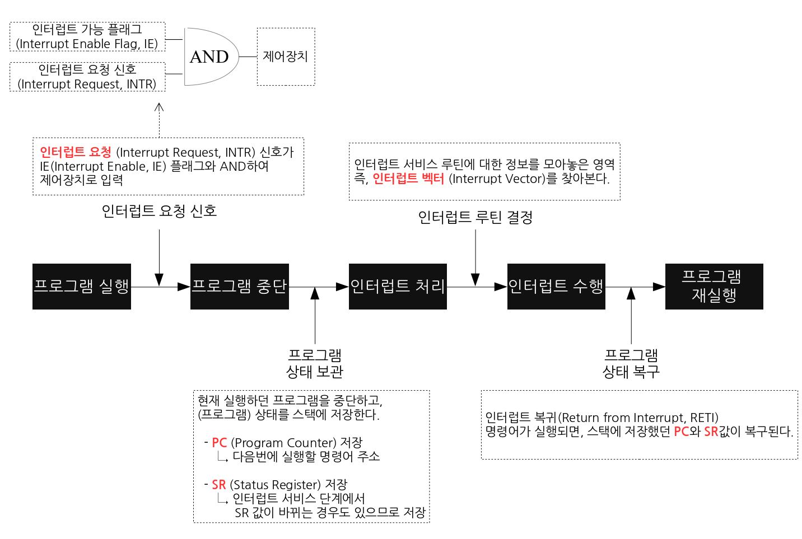
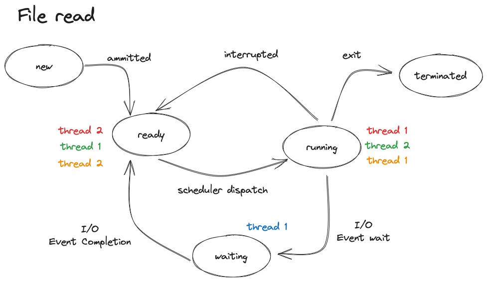
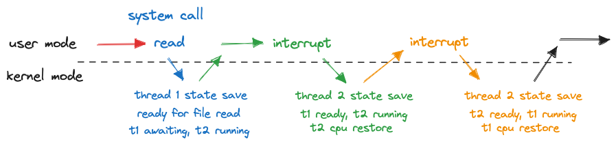

# Interrupt(인터럽트)

## Interrupt의 정의

**CPU가 프로그램을 실행하고 있을 때,** 입출력 하드웨어 등의 장치나 예외상황이 발생하여 처리가 필요할 경우에 **마이크로 오퍼레이션**까지 처리 후 **마이크로프로세서**에게 알려 처리 할 수 있도록 하는 것

## 인터럽트는 어떻게 처리하나요?

1. 현재 실행 중인 작업을 마무리한다. 실행 중인 명령어 사이클을 완료하고, 다음 명령어를 가져오기 위해 CPU는 일시적으로 쉰다.

2. CPU는 중요한 작업을 하는 중이면서도, 하이로인터럽트 마스크 비트를 확인한다. 이 비트가 설정되어 있다면, 인터럽트를 무시하고 계속 작업을 수행한다.

3. 발생한 인터럽트의 종류를 알아낸다. 어떤 일이 일어났는지를 파악하기 위해 인터럽트 벡터를 확인한다.

4. 그 다음, 해당 인터럽트에 대응하는 **인터럽트 서비스 루틴 (ISR, 인터럽트 핸들러)**의 주소를 찾습니다.

5. CPU는 인터럽트 서비스 루틴으로 점프한다. 이 때, 현재 실행 중인 프로그램의 위치를 잠시 저장해둔다.

6. 현재 진행 중인 프로그램의 레지스터 값을 백업한다. 이렇게 함으로써, 인터럽트 처리 중에도 중요한 데이터를 보호할 수 있다.

7. 이제 해당 인터럽트에 대응하는 인터럽트 서비스 루틴을 실행한다. 이 루틴은 인터럽트가 발생한 원인을 처리하고, 필요한 작업을 수행한다.

8. 인터럽트 처리가 끝나면, 백업한 레지스터 값을 복원한다. 그러면 현재 실행 중이던 프로그램을 이어서 수행할 수 있다.

9. 인터럽트 서비스 루틴의 끝에 도달하면, **IRET 명령어**를 사용하여 인터럽트를 해제하고, 원래 실행 위치로 복귀한다.

10. IRET 명령어가 실행되면, 백업해둔 **프로그램 카운터 (PC) 값**을 복원하여, 이전에 실행 중이던 위치로 다시 돌아간다.

## Polling 방식에 대해 설명해주세요.

**_컴퓨터 시스템에서 외부 이벤트를 감지하고 처리하는 접근방식_**

- 폴링 방식은 프로세서가 **주기적으로 혹은 정기적으로** 외부 장치나 상태를 계속 확인하여 어떤 동작을 수행하는 방식
- 프로세서가 직접 확인하기 때문에 외부 이벤트가 발생하지 않더라도 **지속적으로 시스템 자원을 소비**하게 됩니다.
- 예를 들어, 키보드 입력을 폴링하는 경우, 프로세서가 계속해서 키보드 상태를 확인하여 키 입력을 처리합니다.

**Polling 방식 vs 인터럽트 방식**

- 폴링 : 이벤트를 수행하라는 **신호를 받았는지 안 받았는지를 주기적으로 검사**하면서 그 신호를 받았을 대 이벤트를 실행하는 방식
  - 구현이 쉽다는 장점과 반응시간이 느리고 리소스를 많이 차지한다는 단점이 존재
- 인터럽트 : **이벤트를 수행하라는 신호를 받으면** 핸들러를 통해서 바로 이벤트를 수행하는 방식

  - 인터럽트는 정확한 타이밍, 짧은 반응시간의 장점과 핸들러를 통해야하기 때문에 구현상의 단점이 존재

## HW/SW 인터럽트에 대해 설명해주세요.

- HW(하드웨어) 인터럽트

  - 하드웨어 인터럽트는 **외부 하드웨어 장치나 상태**에서 발생하는 이벤트로, 주로 시스템의 물리적인 변화나 입력 신호로 인해 발생한다.
  - 예를 들어, **키보드나 마우스의 버튼 클릭**, **타이머** 등의 하드웨어 장치에서 발생하는 이벤트가 하드웨어 인터럽트로 간주된다.

- SW(소프트웨어) 인터럽트

  - 소프트웨어 인터럽트는 프로그램 실행 중에 **명시적으로 소프트웨어적으로 발생시키는 인터럽트**로, 주로 **시스템 서비스를 호출**하거나 **예외 상황을 처리**하는 데 사용된다.
  - 시스템 서비스를 호출하는 경우, **응용 프로그램이 운영체제의 기능을 활용**하기 위해 소프트웨어 인터럽트를 발생시킨다. 이를 통해 **파일 입출력**, **메모리 관리**, **프로세스 관리** 등의 작업을 수행할 수 있다.
  - 예외 상황을 처리하는 경우, 소프트웨어 인터럽트를 사용하여 **예외 핸들러를 호출**하여 오류나 예외 상황을 처리한다.
  - 예시로는 ZeroDivisionException, System Call 등이 있다.

### 인터럽트와 시스템 콜 처리 예제 : File Read

- 시스템 서비스를 호출하는 경우, **응용 프로그램이 운영체제의 기능을 활용**하기 위해 소프트웨어 인터럽트를 발생시킨다. 이를 통해 **파일 입출력**, **메모리 관리**, **프로세스 관리** 등의 작업을 수행할 수 있다.

**가정 : Running Thread1(t1) 과 Ready Thread2(t2)가 있고, Single Core에서 동작할 때**

- file을 read하기 위해서 system call - read를 호출함
  - 커널 모드로 진입
  - t1의 cpu상태 저장
  - 파일을 읽을 준비(ssd)
    - read system call 은 block system call이기 때문에 t1이 파일을 읽을 준비를 마칠 때까지 기다려야 함 → t1을 waiting 상태로 변경
  - 그러면 현재 cpu는 동작하고 있는 것이 없기 때문에 ready중이던 t2를 running상태로 변경
  - 다시 커널모드에서 유저모드로 전환(현재 cpu자원 통제권은 t2에 있음)
- ssd쪽에서 t1이 file을 읽을 준비가 되었다고 인터럽트를 통해 알려줌
  - 인터럽트를 처리하기 위해 커널모드로 진입
  - t2의 cpu상태를 저장
  - t1을 ready상태로 변경
  - 이전 t2의 cpu상태 복원, 인터럽트 전 중단되었던 부분부터 시작
- (가정 : 멀티 쓰레드 환경) t2가 주어진 timer를 모두 소요함 → 인터럽트 발생
  - 커널모드 진입
  - t2 cpu상태 저장, ready상태가 됨
  - t1이 running상태, file read system call 호출 시 저장했던 t1의 cpu상태가 복원됨
  - 유저모드로 전환
- 이제 통제권은 다시 t1에게, 파일을 읽을 준비를 마친 t1은 이제 실제로 읽어오는 작업을 이어서 수행하게 됨

## 동시에 두 개 이상의 인터럽트가 발생하면, 어떻게 처리해야 하나요?

- 여러 장치에서 인터럽트가 동시에 발생하거나 인터럽트 서비스 루틴 수행 중 인터럽트가 발생했을 경우 **우선순위**를 따져서 처리한다.
  - **전원 이상(Power fail) > 기계 착오(Machine Check) > 외부 신호(External) > 입출력(I/O) > 명령어 잘못 > 프로그램 검사(Program Check) > SVC(SuperVisor Call)**
- 일반적으로 하드웨어 인터럽트가 소프트웨어 인터럽트보다 우선 순위가 높고 내부 인터럽트 보다 외부 인터럽트가 우선 순위가 높다. **(하드웨어 인터럽트 > 소프트웨어 인터럽트) , (외부 인터럽트 > 내부 인터럽트)**
