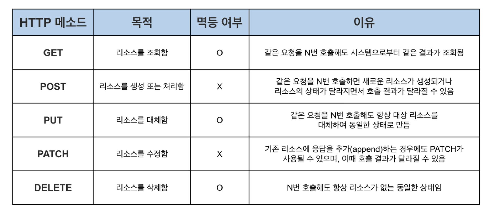
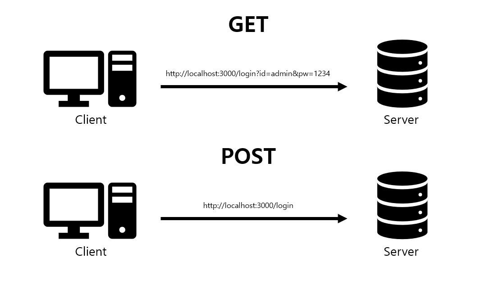

# HTTP Method
HTTP 메서드란 클라이언트와 서버 사이에 이루어지는 요청(Request)과 응답(Response) 데이터를 전송하는 방식을 뜻하며 쉽게 말해 서버가 수행해야할 동작을 지정하는 요청을 보내는 방법입니다. 
- **`GET`**
    - 지정된 리소스의 정보를 요청합니다. 서버는 해당 리소스의 데이터를 응답으로 전송합니다.
    - 전송 형태 : GET [request-uri]?query_string
- **`HEAD`**
    - GET 메소드와 유사하지만, 실제 데이터를 요청하지 않고 헤더 정보만을 받아옵니다. 주로 리소스가 존재하는지 확인하는 용도로 사용됩니다.(웹서버 정보확인, 헬스체크, 버젼확인, 최종 수정일자 확인등의 용도로 사용된다.)
    - 전송 형태 : HEAD [request-uri]
- **`POST`**
    - 서버에 새로운 데이터를 제출하거나 리소스를 생성(CREATE)하기 위해 사용됩니다.
    - 새로 작성된 리소스인 경우 HTTP헤더 항목 Location : URI주소를 포함하여 응답합니다.
    - 전송 형태 : POST [request-uri] Content-Type:[Content Type] [데이터]
- **`PUT`**
    - 지정된 리소스의 데이터를 수정(UPDATE)하거나 새 리소스를 생성합니다.
    - 내용 갱신을 위주로 Location : URI를 보내지 않아도 됩니다.
    - 클라이언트측은 요청된 URI를 그대로 사용하는 것으로 간주합니다.
    - 전송 형태 : PUT [request-uri] Content-Type:[Content Type] [데이터]
- **`PATCH`**
    - PUT과 유사하게 요청된 자원을 수정(UPDATE)할 때 사용합니다.
    - PUT의 경우 자원 전체를 갱신하는 의미지만, PATCH는 해당 자원의 일부를 교체하는 의미로 사용합니다.
    - 전송 형태 : PATCH [request-uri] Content-Type:[Content Type] [데이터]
- **`DELETE`**
    - 지정된 리소스를 삭제할 것을 요청합니다.
    - 안전성 문제로 대부분의 서버에서 비활성화합니다.
    - 전송 형태 : DELETE [request-uri]
- **`HEAD`**
    - 서버 리소스의 헤더(메타 데이터)만을 취득합니다.
- **`OPTIONS`**
    - 리소스가 지원하고 있는 메소드를 취득합니다.
- **`CONNECT`**
    - 프록시 동작의 커널 접속을 변경합니다.
- **`TRACE`**
    - 대상 리소스에 대한 경로를 따라 메시지 루프백 테스트를 수행합니다.

## HTTP Method의 멱등성(Idempotence)
HTTP 메소드의 멱등성(Idempotence)은 동일한 요청을 여러 번 보내더라도 한 번의 요청과 동일한 결과가 나오는 성질을 의미합니다. 즉, 멱등한 메소드는 같은 요청을 여러 번 실행하더라도 서버의 상태가 변하지 않거나 동일한 상태로 유지됩니다.
<p align="center"></p>

+) `HEAD`: HEAD 메소드는 GET과 유사하지만 응답에 실제 데이터가 포함되지 않고 헤더 정보만 반환됩니다. 따라서 GET과 마찬가지로 멱등성을 가집니다.

## GET과 POST의 차이
<p align="center"></p>

| HTTP Method | GET 방식 | POST 방식 |
|:-:|:-:|:-:|
| 사용하는 방식 | 리소스 요청(불러오기) | 리소스 추가 또는 생성 |
| URL 예시 | http://localhost:3000/login?id=admin&pw=1234 | http://localhost:3000/login |
| 데이터가 담기는 곳 | HTTP 패킷 Header | HTTP 패킷 Body |
| 리소스 전달 방식 | 쿼리스트링 | HTTP Body |
| HTTP 응답 코드 | 200 | 201 |
| URL에 데이터 노출 여부 | O | X |
| 캐싱 가능 여부 | O | X |
| 브라우저 기록 | O | X |
| 북마크 추가 | O | X |
| 데이터 길이 제한 | O | X |
| 멱등성(idempotent) | O | X |

1. 목적
    - GET은 주로 서버의 리소스를 조회 요청하는데 사용하는 메서드이며, POST는 클라이언트의 데이터를 서버측에서 처리 요청하는데 사용하는 메서드라는 점에서 차이가 있습니다.
2. 데이터 전달 방식
    - 또한 GET을 활용해서 특정 리소스를 조회하고자 할 때 필요한 파라미터를 주로 쿼리스트링을 통해 전달하지만, POST로 데터를 전달할 때는 body에 담아서 전달하는 차이가 있습니다.
3. 캐싱
    - 단순한 조회를 하기에는 GET이 캐싱 기능도 제공해주어서 GET을 쓰는게 유리합니다.
4. 사용 예시
    - **GET:** 웹 페이지 조회, 검색, 정보 확인 등
    - **POST:** 로그인, 데이터 생성, 업데이트, 폼 제출 등

## POST, PUT, PATCH
```JSON
PUT /members/1
{
name : "hoon",
age : 28,
}


PATCH  /members/1
{
name : "jihoon"
}
```
3가지 메소드는 모두 메시지의 **Body**에 데이터를 담아서 데이터를 쓰거나 생성한다는 공통점이 있지만 `POST`는 새로운 데이터를 생성할 때 `PUT`은 기존의 데이터를 전부 수정할 때, `PATCH`는 기존의 데이터의 일부를 수정할 때 사용하는 방법으로 차이가 있습니다.

## HTTP 1.1 이후로 GET을 활용할 때도 Body에 데이터를 실을 수 있다. 그럼에도 불구하고 이를 지양하는 이유는?
1. **캐싱 및 브라우저 호환성**: GET 요청은 주로 캐싱되고 브라우저 기록에 남을 수 있습니다. 본문을 포함한 GET 요청은 캐시 처리 및 브라우저 기록에 문제를 일으킬 수 있습니다.
2. **멱등성 깨짐**: GET 요청은 멱등성을 가지는 것이 기본 원칙입니다. 하지만 본문을 포함하는 경우, 이러한 요청이 서버 상태나 데이터를 변경시킬 수 있으며 멱등성이 깨질 가능성이 높습니다.
3. **보안 이슈**: URL에 데이터가 노출되는 GET 요청보다는 POST 요청이 더 보안적으로 안전합니다. URL에 데이터를 노출하면 민감한 정보가 유출될 수 있습니다.
4. **서버 및 프록시 제약**: 일부 서버 및 프록시 서버는 GET 요청에서 본문을 지원하지 않거나 처리하지 않을 수 있습니다.
5. **어떤 메소드를 사용해야 할지 명확한 분리**: HTTP의 설계 원칙에 따르면 GET은 정보를 요청하고 POST는 데이터를 제출하는 역할로 분리되어야 합니다. 본문을 포함한 GET 요청은 이러한 역할 분리를 어렵게 만들 수 있습니다.

- GET요청은 캐싱이 잘 이루어지기 때문에, 반복된 요청에는 캐싱을 사용해서 응답할 수 있습니다. 하지만 body에 데이터를 담아 보내면 캐싱이 어려워지는 문제가 있을 수 있습니다.
    - 캐싱이나 프록시 설계 일부는 GET의 body값을 참조하지 않는 경우가 있기 때문입니다.
    - 중간에 캐시 프록시 서버가 있는 경우, 쿼리 파라미터를 활용한 GET 요청 시 프록시 서버가 중간에 캐싱하여 다수의 클라이언트에 동일한 데이터를 제공할 수 있지만, 데이터를 body에 담아 보내는 경우 이러한 캐싱이 어려워질 수 있습니다.
- 이미 통용화 된 디자인 철학을 준수하며 개발을 진행하는 구성원과 협업시 설계가 어려워지는 문제점도 있을 수 있습니다.
- 경우에 따라 해당 방식을 지원하지 않는 클라이언트도 있을 수 있습니다. 따라서 해당 방식을 사용할지, 어떻게 설계할지는 시스템 요구사항에 맞춰 적절하게 선택해야 할 것 같습니다.

## PUT은 멱등한데, POST와 PATCH는 멱등하지 않은 이유
`PUT`은 예를들면 AGE=30으로 계속 반복 호출하는 것이라고 생각하시면 됩니다. AGE에 30을 할당하는 행위는 몇번을 반복해도 항상 AGE가 30일 것입니다. `PATCH`는 반면에 AGE = AGE+1 이라고 생각하시면 됩니다. 이것은 호출될때마다 AGE의 값이 바뀌게 되겠죠. 그래서 PUT은 멱등, PATCH는 멱등하지 않다라고 합니다. `POST`의 경우 같은 데이터를 계속해서 POST로 전송하게 될경우 서버에서 새로운 리소스를 생성하게 됩니다.(아이디를 새로 발급) 그래서 멱등하지 않다고 보는 것입니다.

# 📚 Reference
[[HTTP] HTTP 메소드의 멱등성(Idempotence)과 Delete 메소드가 멱등한 이유](https://mangkyu.tistory.com/251)

[벨로그 - HTTP Method란? (GET,POST,PUT,DELETE)]([https://velog.io/@yh20studio/CS-Http-Method-란-GET-POST-PUT-DELETE](https://velog.io/@yh20studio/CS-Http-Method-%EB%9E%80-GET-POST-PUT-DELETE))

[블로그 - HTTP 메소드의 멱등성, 그리고 안전한 메서드](https://hudi.blog/http-method-idempotent/)

[인프런 - 멱등이 잘 이해가 가지 않습니다]([https://www.inflearn.com/questions/275220/멱등이-잘-이해가-가지-않습니다](https://www.inflearn.com/questions/275220/%EB%A9%B1%EB%93%B1%EC%9D%B4-%EC%9E%98-%EC%9D%B4%ED%95%B4%EA%B0%80-%EA%B0%80%EC%A7%80-%EC%95%8A%EC%8A%B5%EB%8B%88%EB%8B%A4))

[벨로그 - [HTTP] GET, POST, PUT, PATCH 차이]([https://velog.io/@dyunge_100/Spring-Thread-Pool#13-get과-post의-차이점을-간략히-나타낸-표](https://velog.io/@dyunge_100/Spring-Thread-Pool#13-get%EA%B3%BC-post%EC%9D%98-%EC%B0%A8%EC%9D%B4%EC%A0%90%EC%9D%84-%EA%B0%84%EB%9E%B5%ED%9E%88-%EB%82%98%ED%83%80%EB%82%B8-%ED%91%9C))
[깃북 - HTTP METHOD](https://incheol-jung.gitbook.io/docs/q-and-a/computer-science/http-method)

[우피 - 3. HTTP 기본](https://catsbi.oopy.io/5c0b482c-b427-4052-9030-d2be0810eeb6)

[[HTTP] GET vs POST, GET은 body 값을 가지면 안 될까?](https://cl8d.tistory.com/63)

[티스토리 - HTTP 메서드 종류 & 요청 흐름 총 정리]([https://inpa.tistory.com/entry/WEB-🌐-HTTP-메서드-종류-통신-과정-💯-총정리](https://inpa.tistory.com/entry/WEB-%F0%9F%8C%90-HTTP-%EB%A9%94%EC%84%9C%EB%93%9C-%EC%A2%85%EB%A5%98-%ED%86%B5%EC%8B%A0-%EA%B3%BC%EC%A0%95-%F0%9F%92%AF-%EC%B4%9D%EC%A0%95%EB%A6%AC))

[brunchstory - HTTP GET 메소드와 body](https://brunch.co.kr/@kd4/158)