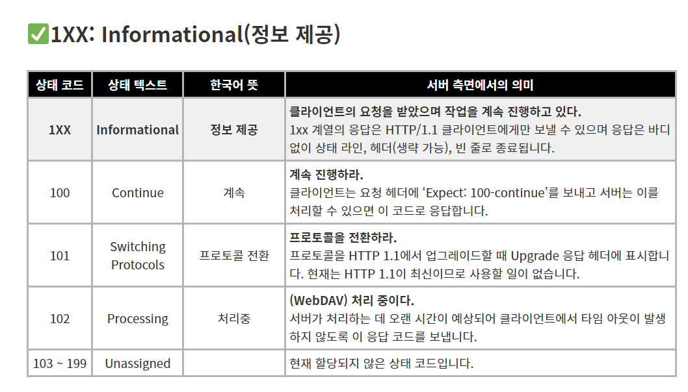
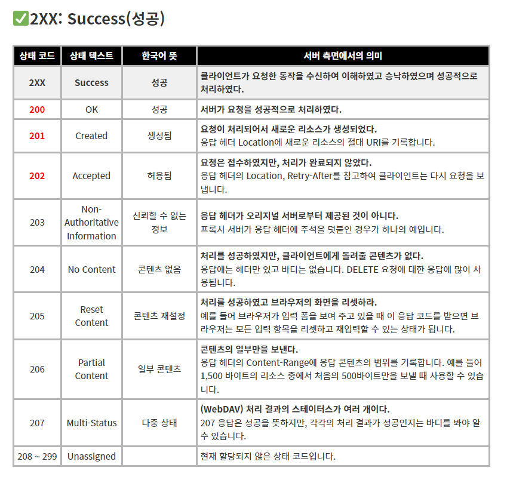
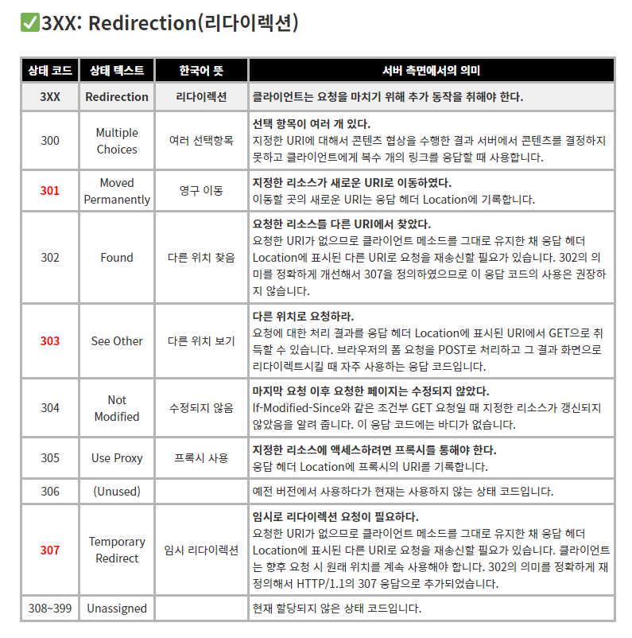
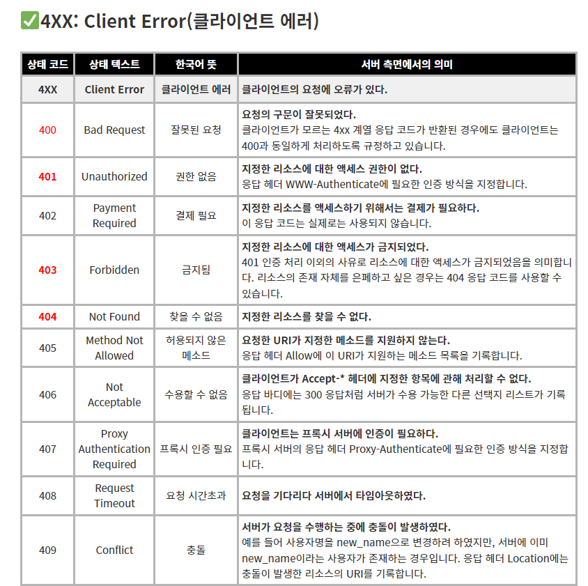
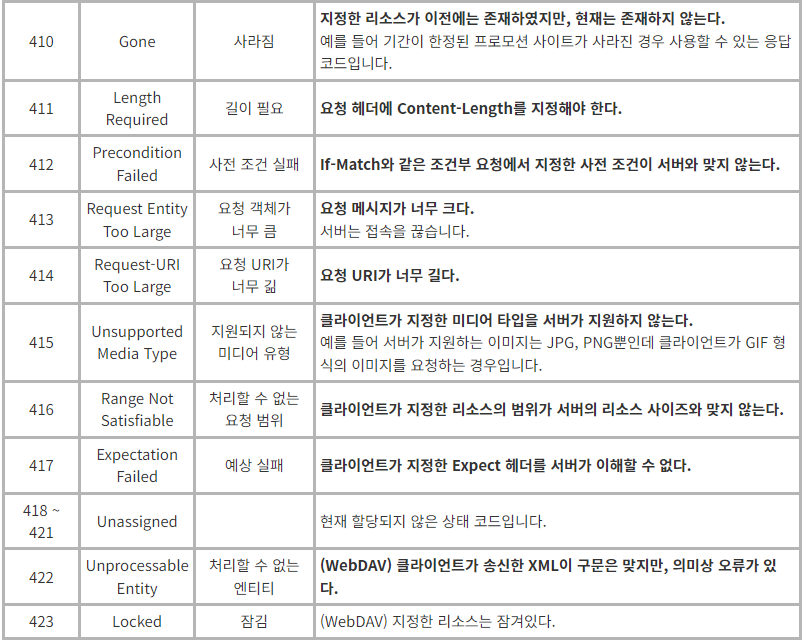
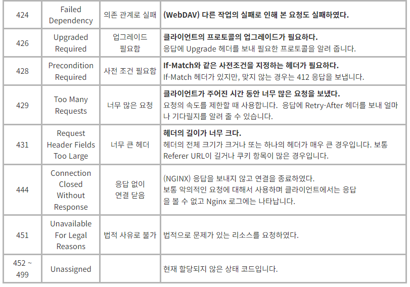
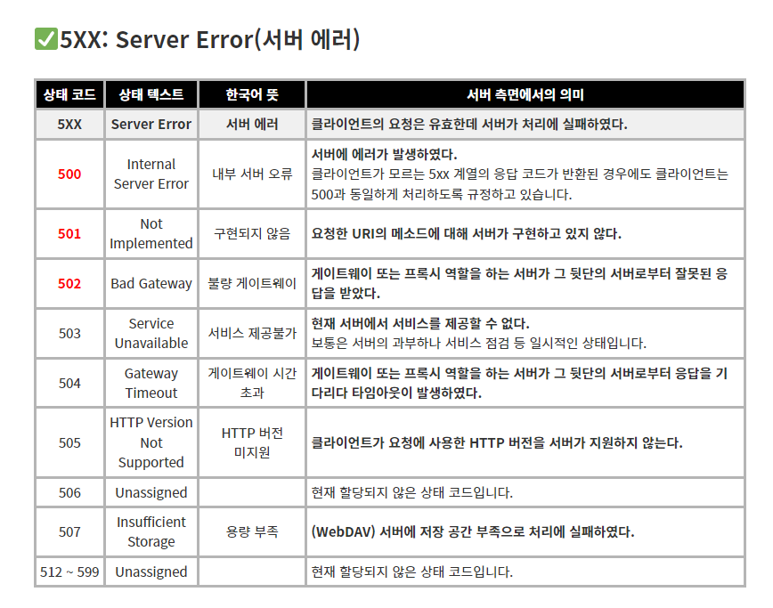
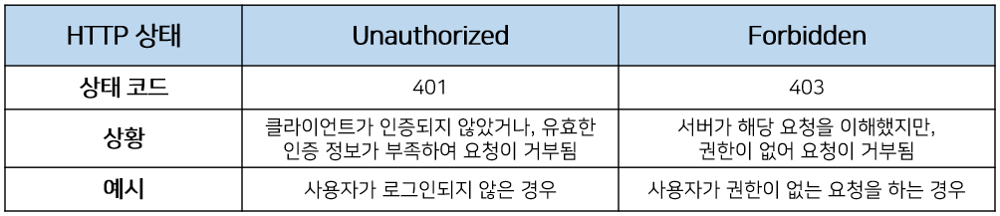

# Response Code(HTTP 응답코드)

## 💡 Response Code(HTTP 응답코드)에 대해 설명해주세요

**`HTTP(하이퍼텍스트 전송 프로토콜)`** 응답 코드는 클라이언트가 서버로 요청을 보내고, 서버가 해당 요청에 대한 처리 결과를 클라이언트에게 알려주는 데 사용되는 숫자로 된 코드입니다. 이 상태 코드(status code)는 서버의 상태와 클라이언트 요청의 처리 결과를 나타내는 중요한 정보를 담고 있습니다. HTTP 응답 코드는 3자리 숫자로 이루어져 있으며, 첫 번째 숫자는 HTTP 응답의 종류를 구분하는 데 사용하며 나머지 2개의 숫자는 세부적인 응답 내용 구분을 위한 번호입니다.

- **1XX: Informational(정보 제공)**
  - 임시 응답으로 현재 클라이언트의 요청까지는 처리되었으니 계속 진행하라는 의미입니다. HTTP 1.1 버전부터 추가되었습니다.
- **2XX: Success(성공)**
  - 클라이언트의 요청이 서버에서 성공적으로 처리되었다는 의미입니다.
- **3XX: Redirection(리다이렉션)**
  - 완전한 처리를 위해서 추가 동작이 필요한 경우입니다. 주로 서버의 주소 또는 요청한 URI의 웹 문서가 이동되었으니 그 주소로 다시 시도하라는 의미입니다.
- **4XX: Client Error(클라이언트 에러)**
  - 없는 페이지를 요청하는 등 클라이언트의 요청 메시지 내용이 잘못된 경우를 의미합니다.
- **5XX: Server Error(서버 에러)**
  - 서버 사정으로 메시지 처리에 문제가 발생한 경우입니다. 서버의 부하, DB 처리 과정 오류, 서버에서 익셉션이 발생하는 경우를 의미합니다.

### 상세 응답 코드

  
<h3>1XX: Informational(정보 제공)</h3>

  

  
<h3>2XX: Success(성공)</h3>

  

                                                                                                             

  
<h3>3XX: Redirection(리다이렉션)</h3>

  

  
<h3>4XX:  Client Error(클라이언트 에러)</h3>

  

  

  

  
<h3>5XX: Server Error(서버 에러)</h3>

  

 

## 📑 꼬리질문

### 401 (Unauthorized) 와 403 (Forbidden)은 의미적으로 어떤 차이가 있나요?

  

두 응답코드 모두 클라이언트가 요청에 대한 권한이 없다고 알려주는 상태 코드입니다. 하지만 둘은 401은 클라이언트가 ‘`인증`’되지 않았다는 점, 403은 ‘`인가`’되지 않았다는 점에서 차이가 있습니다.

- `401(Unauthorized)`은 로그인이 되어있지 않은 상태에서 무언가를 요청하는 경우와 같이 클라이언트가 인증되지 않았거나, 유효한 인증 정보가 부족하여 요청이 거부되었음을 의미하는 상태값 입니다.
- `403(Forbidden)`은 로그인하여 인증되었지만 접근 권한이 없는 요청을 수행한 경우와 같이 인증된 클라이언트가 해당 요청에 대한 권한이 없다고 알려주는 것입니다.

### 200(ok) 와 201(created)의 차이에 대해 설명해주세요.

| 200 | OK      | 성공   | 서버가 요청을 성공적으로 처리하였다.                                                                     |
| --- | ------- | ------ | -------------------------------------------------------------------------------------------------------- |
| 201 | Created | 생성됨 | 요청이 처리되어서 새로운 리소스가 생성되었다.응답 헤더 Location에 새로운 리소스의 절대 URI를 기록합니다. |

둘다 서버가 요청을 성공적으로 처리했다는 것을 이야기하지만 201은 성공한 요청이 POST/PUT을 통해 새로운 데이터를 쓰거나 추가하는 작업에 성공했다는 의미를 나타내줍니다.
 

## 🐍 꼬꼬무

### 500(Internet Server Error)과 502(Bad Gateway)의 차이에 대해 설명해 주세요.

| 500 | Internal Server Error | 내부 서버 오류  | 서버에 에러가 발생하였다.클라이언트가 모르는 5xx 계열의 응답 코드가 반환된 경우에도 클라이언트는 500과 동일하게 처리하도록 규정하고 있습니다. |
| --- | --------------------- | --------------- | --------------------------------------------------------------------------------------------------------------------------------------------- |
| 502 | Bad Gateway           | 불량 게이트웨이 | 게이트웨이 또는 프록시 역할을 하는 서버가 그 뒷단의 서버로부터 잘못된 응답을 받았다.                                                          |

**`500`:** 서버가 처리하는 과정에서 예상하지 못한 상황일 때 응답

**`502`:** 서버측의 설정이 잘못돼 요청을 처리하지 못한다는 응답
 

## 📚 Reference

- [Wikipedia - HTTP 상태 코드](<[https://ko.wikipedia.org/wiki/HTTP_상태_코드](https://ko.wikipedia.org/wiki/HTTP_%EC%83%81%ED%83%9C_%EC%BD%94%EB%93%9C)>)
- [티스토리 - HTTP 상태 401(Unauthorized) vs 403(Forbidden)](https://mangkyu.tistory.com/146)
- [한빛 - http 상태코드 표1xx 5xx 전체 요약정리](<[https://hongong.hanbit.co.kr/http-상태-코드-표-1xx-5xx-전체-요약-정리/](https://hongong.hanbit.co.kr/http-%EC%83%81%ED%83%9C-%EC%BD%94%EB%93%9C-%ED%91%9C-1xx-5xx-%EC%A0%84%EC%B2%B4-%EC%9A%94%EC%95%BD-%EC%A0%95%EB%A6%AC/)>)
- [OKKY - http status code 200 과 201의 차이 아시는분?](https://okky.kr/questions/371034)
- [github.io - HTTP 401과 403](https://kimdoky.github.io/http/2018/12/30/401_403/)
