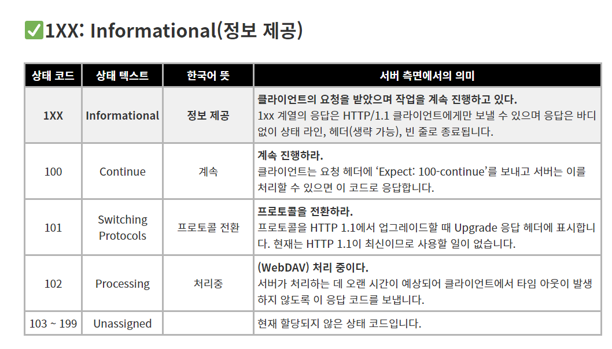
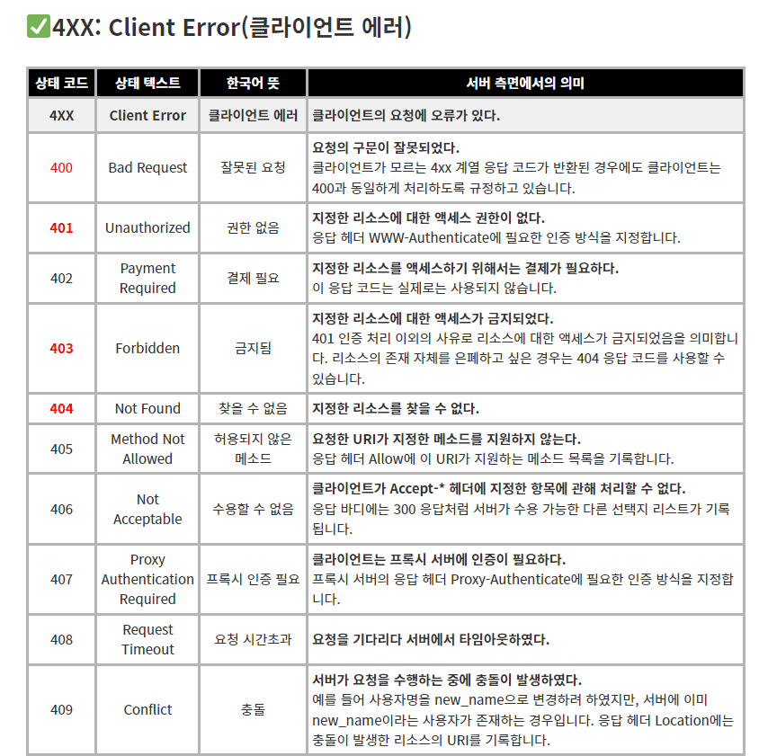
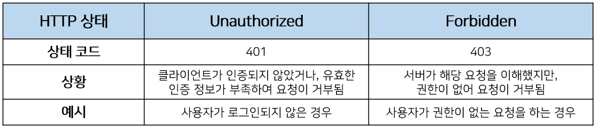

# Response Code(HTTP 응답코드)

## Response Code(HTTP 응답코드)에 대해 설명해주세요

**`HTTP(하이퍼텍스트 전송 프로토콜)`** 응답 코드는 클라이언트가 서버로 요청을 보내고, 서버가 해당 요청에 대한 처리 결과를 클라이언트에게 알려주는 데 사용되는 숫자로 된 코드입니다. 이 상태 코드(status code)는 서버의 상태와 클라이언트 요청의 처리 결과를 나타내는 중요한 정보를 담고 있습니다. HTTP 응답 코드는 3자리 숫자로 이루어져 있으며, 첫 번째 숫자는 HTTP 응답의 종류를 구분하는 데 사용하며 나머지 2개의 숫자는 세부적인 응답 내용 구분을 위한 번호입니다.

- **1XX: Informational(정보 제공)**
  - 임시 응답으로 현재 클라이언트의 요청까지는 처리되었으니 계속 진행하라는 의미입니다. HTTP 1.1 버전부터 추가되었습니다.
- **2XX: Success(성공)**
  - 클라이언트의 요청이 서버에서 성공적으로 처리되었다는 의미입니다.
- **3XX: Redirection(리다이렉션)**
  - 완전한 처리를 위해서 추가 동작이 필요한 경우입니다. 주로 서버의 주소 또는 요청한 URI의 웹 문서가 이동되었으니 그 주소로 다시 시도하라는 의미입니다.
- **4XX: Client Error(클라이언트 에러)**
  - 없는 페이지를 요청하는 등 클라이언트의 요청 메시지 내용이 잘못된 경우를 의미합니다.
- **5XX: Server Error(서버 에러)**
  - 서버 사정으로 메시지 처리에 문제가 발생한 경우입니다. 서버의 부하, DB 처리 과정 오류, 서버에서 익셉션이 발생하는 경우를 의미합니다.

### 상세 응답 코드

  
<h3>1XX: Informational(정보 제공)</h3>

  

| 상태 코드 | 상태 텍스트         | 한국어 뜻     | 서버 측면에서의 의미                                                                                                                                                                |
| --------- | ------------------- | ------------- | ----------------------------------------------------------------------------------------------------------------------------------------------------------------------------------- |
| 1XX       | Informational       | 정보 제공     | 클라이언트의 요청을 받았으며 작업을 계속 진행하고 있다. 1xx 계열의 응답은 HTTP/1.1 클라이언트에게만 보낼 수 있으며 응답은 바디 없이 상태 라인, 헤더(생략 가능), 빈 줄로 종료됩니다. |
| 100       | Continue            | 계속          | 계속 진행하라.클라이언트는 요청 헤더에 ‘Expect: 100-continue’를 보내고 서버는 이를 처리할 수 있으면 이 코드로 응답합니다.                                                           |
| 101       | Switching Protocols | 프로토콜 전환 | 프로토콜을 전환하라.프로토콜을 HTTP 1.1에서 업그레이드할 때 Upgrade 응답 헤더에 표시합니다. 현재는 HTTP 1.1이 최신이므로 사용할 일이 없습니다.                                      |
| 102       | Processing          | 처리중        | (WebDAV) 처리 중이다.서버가 처리하는 데 오랜 시간이 예상되어 클라이언트에서 타임 아웃이 발생하지 않도록 이 응답 코드를 보냅니다.                                                    |
| 103 ~ 199 | Unassigned          |               | 현재 할당되지 않은 상태 코드입니다.                                                                                                                                                 |

  
<h3>2XX: Success(성공)</h3>

  

| 상태 코드 | 상태 텍스트                  | 한국어 뜻          | 서버 측면에서의 의미                                                                                                                                                                     |
| --------- | ---------------------------- | ------------------ | ---------------------------------------------------------------------------------------------------------------------------------------------------------------------------------------- |
| 2XX       | Success                      | 성공               | 클라이언트가 요청한 동작을 수신하여 이해하였고 승낙하였으며 성공적으로 처리하였다.                                                                                                       |
| 200       | OK                           | 성공               | 서버가 요청을 성공적으로 처리하였다.                                                                                                                                                     |
| 201       | Created                      | 생성됨             | 요청이 처리되어서 새로운 리소스가 생성되었다.응답 헤더 Location에 새로운 리소스의 절대 URI를 기록합니다.                                                                                 |
| 202       | Accepted                     | 허용됨             | 요청은 접수하였지만, 처리가 완료되지 않았다.응답 헤더의 Location, Retry-After를 참고하여 클라이언트는 다시 요청을 보냅니다.                                                              |
| 203       | Non-AuthoritativeInformation | 신뢰할 수 없는정보 | 응답 헤더가 오리지널 서버로부터 제공된 것이 아니다.프록시 서버가 응답 헤더에 주석을 덧붙인 경우가 하나의 예입니다.                                                                       |
| 204       | No Content                   | 콘텐츠 없음        | 처리를 성공하였지만, 클라이언트에게 돌려줄 콘텐츠가 없다.응답에는 헤더만 있고 바디는 없습니다. DELETE 요청에 대한 응답에 많이 사용됩니다.                                                |
| 205       | Reset Content                | 콘텐츠 재설정      | 처리를 성공하였고 브라우저의 화면을 리셋하라.예를 들어 브라우저가 입력 폼을 보여 주고 있을 때 이 응답 코드를 받으면 브라우저는 모든 입력 항목을 리셋하고 재입력할 수 있는 상태가 됩니다. |
| 206       | Partial Content              | 일부 콘텐츠        | 콘텐츠의 일부만을 보낸다.응답 헤더의 Content-Range에 응답 콘텐츠의 범위를 기록합니다. 예를 들어 1,500 바이트의 리소스 중에서 처음의 500바이트만을 보낼 때 사용할 수 있습니다.            |
| 207       | Multi-Status                 | 다중 상태          | (WebDAV) 처리 결과의 스테이터스가 여러 개이다.207 응답은 성공을 뜻하지만, 각각의 처리 결과가 성공인지는 바디를 봐야 알 수 있습니다.                                                      |
| 208 ~ 299 | Unassigned                   |                    | 현재 할당되지 않은 상태 코드입니다.                                                                                                                                                      |

                                                                                                             

  
<h3>3XX: Redirection(리다이렉션)</h3>

  

| 상태 코드 | 상태 텍스트        | 한국어 뜻       | 서버 측면에서의 의미                                                                                                                                                                                                                                                                                      |
| --------- | ------------------ | --------------- | --------------------------------------------------------------------------------------------------------------------------------------------------------------------------------------------------------------------------------------------------------------------------------------------------------- |
| 3XX       | Redirection        | 리다이렉션      | 클라이언트는 요청을 마치기 위해 추가 동작을 취해야 한다.                                                                                                                                                                                                                                                  |
| 300       | Multiple Choices   | 여러 선택항목   | 선택 항목이 여러 개 있다.지정한 URI에 대해서 콘텐츠 협상을 수행한 결과 서버에서 콘텐츠를 결정하지 못하고 클라이언트에게 복수 개의 링크를 응답할 때 사용합니다.                                                                                                                                            |
| 301       | Moved Permanently  | 영구 이동       | 지정한 리소스가 새로운 URI로 이동하였다.이동할 곳의 새로운 URI는 응답 헤더 Location에 기록합니다.                                                                                                                                                                                                         |
| 302       | Found              | 다른 위치 찾음  | 요청한 리소스를 다른 URI에서 찾았다.요청한 URI가 없으므로 클라이언트 메소드를 그대로 유지한 채 응답 헤더 Location에 표시된 다른 URI로 요청을 재송신할 필요가 있습니다. 302의 의미를 정확하게 개선해서 307을 정의하였으므로 이 응답 코드의 사용은 권장하지 않습니다.                                       |
| 303       | See Other          | 다른 위치 보기  | 다른 위치로 요청하라.요청에 대한 처리 결과를 응답 헤더 Location에 표시된 URI에서 GET으로 취득할 수 있습니다. 브라우저의 폼 요청을 POST로 처리하고 그 결과 화면으로 리다이렉트시킬 때 자주 사용하는 응답 코드입니다.                                                                                       |
| 304       | Not Modified       | 수정되지 않음   | 마지막 요청 이후 요청한 페이지는 수정되지 않았다.If-Modified-Since와 같은 조건부 GET 요청일 때 지정한 리소스가 갱신되지 않았음을 알려 줍니다. 이 응답 코드에는 바디가 없습니다.                                                                                                                           |
| 305       | Use Proxy          | 프록시 사용     | 지정한 리소스에 액세스하려면 프록시를 통해야 한다.응답 헤더 Location에 프록시의 URI를 기록합니다.                                                                                                                                                                                                         |
| 306       | (Unused)           |                 | 예전 버전에서 사용하다가 현재는 사용하지 않는 상태 코드입니다.                                                                                                                                                                                                                                            |
| 307       | Temporary Redirect | 임시 리다이렉션 | 임시로 리다이렉션 요청이 필요하다.요청한 URI가 없으므로 클라이언트 메소드를 그대로 유지한 채 응답 헤더 Location에 표시된 다른 URI로 요청을 재송신할 필요가 있습니다. 클라이언트는 향후 요청 시 원래 위치를 계속 사용해야 합니다. 302의 의미를 정확하게 재정의해서 HTTP/1.1의 307 응답으로 추가되었습니다. |
| 308~399   | Unassigned         |                 | 현재 할당되지 않은 상태 코드입니다.                                                                                                                                                                                                                                                                       |

  
<h3>4XX:  Client Error(클라이언트 에러)</h3>

  

| 상태 코드 | 상태 텍스트                        | 한국어 뜻                | 서버 측면에서의 의미                                                                                                                                                                                                        |
| --------- | ---------------------------------- | ------------------------ | --------------------------------------------------------------------------------------------------------------------------------------------------------------------------------------------------------------------------- |
| 4XX       | Client Error                       | 클라이언트 에러          | 클라이언트의 요청에 오류가 있다.                                                                                                                                                                                            |
| 400       | Bad Request                        | 잘못된 요청              | 요청의 구문이 잘못되었다.클라이언트가 모르는 4xx 계열 응답 코드가 반환된 경우에도 클라이언트는 400과 동일하게 처리하도록 규정하고 있습니다.                                                                                 |
| 401       | Unauthorized                       | 권한 없음                | 지정한 리소스에 대한 액세스 권한이 없다.응답 헤더 WWW-Authenticate에 필요한 인증 방식을 지정합니다.                                                                                                                         |
| 402       | Payment Required                   | 결제 필요                | 지정한 리소스를 액세스하기 위해서는 결제가 필요하다.이 응답 코드는 실제로는 사용되지 않습니다.                                                                                                                              |
| 403       | Forbidden                          | 금지됨                   | 지정한 리소스에 대한 액세스가 금지되었다.401 인증 처리 이외의 사유로 리소스에 대한 액세스가 금지되었음을 의미합니다. 리소스의 존재 자체를 은폐하고 싶은 경우는 404 응답 코드를 사용할 수 있습니다.                          |
| 404       | Not Found                          | 찾을 수 없음             | 지정한 리소스를 찾을 수 없다.                                                                                                                                                                                               |
| 405       | Method Not Allowed                 | 허용되지 않은메소드      | 요청한 URI가 지정한 메소드를 지원하지 않는다.응답 헤더 Allow에 이 URI가 지원하는 메소드 목록을 기록합니다.                                                                                                                  |
| 406       | Not Acceptable                     | 수용할 수 없음           | 클라이언트가 Accept-\* 헤더에 지정한 항목에 관해 처리할 수 없다.응답 바디에는 300 응답처럼 서버가 수용 가능한 다른 선택지 리스트가 기록됩니다.                                                                              |
| 407       | Proxy AuthenticationRequired       | 프록시 인증 필요         | 클라이언트는 프록시 서버에 인증이 필요하다.프록시 서버의 응답 헤더 Proxy-Authenticate에 필요한 인증 방식을 지정합니다.                                                                                                      |
| 408       | Request Timeout                    | 요청 시간초과            | 요청을 기다리다 서버에서 타임아웃하였다.                                                                                                                                                                                    |
| 409       | Conflict                           | 충돌                     | 서버가 요청을 수행하는 중에 충돌이 발생하였다.예를 들어 사용자명을 new_name으로 변경하려 하였지만, 서버에 이미 new_name이라는 사용자가 존재하는 경우입니다. 응답 헤더 Location에는 충돌이 발생한 리소스의 URI를 기록합니다. |
| 410       | Gone                               | 사라짐                   | 지정한 리소스가 이전에는 존재하였지만, 현재는 존재하지 않는다.예를 들어 기간이 한정된 프로모션 사이트가 사라진 경우 사용할 수 있는 응답 코드입니다.                                                                         |
| 411       | Length Required                    | 길이 필요                | 요청 헤더에 Content-Length를 지정해야 한다.                                                                                                                                                                                 |
| 412       | Precondition Failed                | 사전 조건 실패           | If-Match와 같은 조건부 요청에서 지정한 사전 조건이 서버와 맞지 않는다.                                                                                                                                                      |
| 413       | Request EntityToo Large            | 요청 객체가너무 큼       | 요청 메시지가 너무 크다.서버는 접속을 끊습니다.                                                                                                                                                                             |
| 414       | Request-URIToo Large               | 요청 URI가너무 긺        | 요청 URI가 너무 길다.                                                                                                                                                                                                       |
| 415       | UnsupportedMedia Type              | 지원되지 않는미디어 유형 | 클라이언트가 지정한 미디어 타입을 서버가 지원하지 않는다.예를 들어 서버가 지원하는 이미지는 JPG, PNG뿐인데 클라이언트가 GIF 형식의 이미지를 요청하는 경우입니다.                                                            |
| 416       | Range Not Satisfiable              | 처리할 수 없는요청 범위  | 클라이언트가 지정한 리소스의 범위가 서버의 리소스 사이즈와 맞지 않는다.                                                                                                                                                     |
| 417       | Expectation Failed                 | 예상 실패                | 클라이언트가 지정한 Expect 헤더를 서버가 이해할 수 없다.                                                                                                                                                                    |
| 418 ~ 421 | Unassigned                         |                          | 현재 할당되지 않은 상태 코드입니다.                                                                                                                                                                                         |
| 422       | Unprocessable Entity               | 처리할 수 없는엔티티     | (WebDAV) 클라이언트가 송신한 XML이 구문은 맞지만, 의미상 오류가 있다.                                                                                                                                                       |
| 423       | Locked                             | 잠김                     | (WebDAV) 지정한 리소스는 잠겨있다.                                                                                                                                                                                          |
| 424       | Failed Dependency                  | 의존 관계로 실패         | (WebDAV) 다른 작업의 실패로 인해 본 요청도 실패하였다.                                                                                                                                                                      |
| 426       | Upgraded Required                  | 업그레이드필요함         | 클라이언트의 프로토콜의 업그레이드가 필요하다. 응답에 Upgrade 헤더를 보내 필요한 프로토콜을 알려 줍니다.                                                                                                                    |
| 428       | Precondition Required              | 사전 조건 필요함         | If-Match와 같은 사전조건을 지정하는 헤더가 필요하다. If-Match 헤더가 있지만, 맞지 않는 경우는 412 응답을 보냅니다.                                                                                                          |
| 429       | Too Many Requests                  | 너무 많은 요청           | 클라이언트가 주어진 시간 동안 너무 많은 요청을 보냈다.요청의 속도를 제한할 때 사용합니다.  응답에 Retry-After 헤더를 보내 얼마나 기다릴지를 알려 줄 수 있습니다.                                                            |
| 431       | Request Header Fields Too Large    | 너무 큰 헤더             | 헤더의 길이가 너무 크다. 헤더의 전체 크기가 크거나 또는 하나의 헤더가 매우 큰 경우입니다. 보통 Referer URL이 길거나 쿠키 항목이 많은 경우입니다.                                                                            |
| 444       | Connection Closed Without Response | 응답 없이연결 닫음       | (NGINX) 응답을 보내지 않고 연결을 종료하였다.보통 악의적인 요청에 대해서 사용하며 클라이언트에서는 응답을 볼 수 없고 Nginx 로그에는 나타납니다.                                                                             |
| 451       | Unavailable For Legal Reasons      | 법적 사유로 불가         | 법적으로 문제가 있는 리소스를 요청하였다.                                                                                                                                                                                   |
| 452 ~ 499 | Unassigned                         |                          | 현재 할당되지 않은 상태 코드입니다.                                                                                                                                                                                         |

 

  
<h3>5XX: Server Error(서버 에러)</h3>

  

| 상태 코드 | 상태 텍스트                | 한국어 뜻           | 서버 측면에서의 의미                                                                                                                          |
| --------- | -------------------------- | ------------------- | --------------------------------------------------------------------------------------------------------------------------------------------- |
| 5XX       | Server Error               | 서버 에러           | 클라이언트의 요청은 유효한데 서버가 처리에 실패하였다.                                                                                        |
| 500       | Internal Server Error      | 내부 서버 오류      | 서버에 에러가 발생하였다.클라이언트가 모르는 5xx 계열의 응답 코드가 반환된 경우에도 클라이언트는 500과 동일하게 처리하도록 규정하고 있습니다. |
| 501       | Not Implemented            | 구현되지 않음       | 요청한 URI의 메소드에 대해 서버가 구현하고 있지 않다.                                                                                         |
| 502       | Bad Gateway                | 불량 게이트웨이     | 게이트웨이 또는 프록시 역할을 하는 서버가 그 뒷단의 서버로부터 잘못된 응답을 받았다.                                                          |
| 503       | Service Unavailable        | 서비스 제공불가     | 현재 서버에서 서비스를 제공할 수 없다.보통은 서버의 과부하나 서비스 점검 등 일시적인 상태입니다.                                              |
| 504       | Gateway Timeout            | 게이트웨이 시간초과 | 게이트웨이 또는 프록시 역할을 하는 서버가 그 뒷단의 서버로부터 응답을 기다리다 타임아웃이 발생하였다.                                         |
| 505       | HTTP Version Not Supported | HTTP 버전미지원     | 클라이언트가 요청에 사용한 HTTP 버전을 서버가 지원하지 않는다.                                                                                |
| 506       | Unassigned                 |                     | 현재 할당되지 않은 상태 코드입니다.                                                                                                           |
| 507       | Insufficient Storage       | 용량 부족           | (WebDAV) 서버에 저장 공간 부족으로 처리에 실패하였다.                                                                                         |
| 512 ~ 599 | Unassigned                 |                     | 현재 할당되지 않은 상태 코드입니다.                                                                                                           |

## 401 (Unauthorized) 와 403 (Forbidden)은 의미적으로 어떤 차이가 있나요?

  

두 응답코드 모두 클라이언트가 요청에 대한 권한이 없다고 알려주는 상태 코드입니다. 하지만 둘은 401은 클라이언트가 ‘`인증`’되지 않았다는 점, 403은 ‘`인가`’되지 않았다는 점에서 차이가 있습니다.

- `401(Unauthorized)`은 로그인이 되어있지 않은 상태에서 무언가를 요청하는 경우와 같이 클라이언트가 인증되지 않았거나, 유효한 인증 정보가 부족하여 요청이 거부되었음을 의미하는 상태값 입니다.
- `403(Forbidden)`은 로그인하여 인증되었지만 접근 권한이 없는 요청을 수행한 경우와 같이 인증된 클라이언트가 해당 요청에 대한 권한이 없다고 알려주는 것입니다.

## 200(ok) 와 201(created)의 차이에 대해 설명해주세요.

| 200 | OK      | 성공   | 서버가 요청을 성공적으로 처리하였다.                                                                     |
| --- | ------- | ------ | -------------------------------------------------------------------------------------------------------- |
| 201 | Created | 생성됨 | 요청이 처리되어서 새로운 리소스가 생성되었다.응답 헤더 Location에 새로운 리소스의 절대 URI를 기록합니다. |

둘다 서버가 요청을 성공적으로 처리했다는 것을 이야기하지만 201은 성공한 요청이 POST/PUT을 통해 새로운 데이터를 쓰거나 추가하는 작업에 성공했다는 의미를 나타내줍니다.

## 500(Internet Server Error)과 502(Bad Gateway)의 차이에 대해 설명해 주세요.

| 500 | Internal Server Error | 내부 서버 오류  | 서버에 에러가 발생하였다.클라이언트가 모르는 5xx 계열의 응답 코드가 반환된 경우에도 클라이언트는 500과 동일하게 처리하도록 규정하고 있습니다. |
| --- | --------------------- | --------------- | --------------------------------------------------------------------------------------------------------------------------------------------- |
| 502 | Bad Gateway           | 불량 게이트웨이 | 게이트웨이 또는 프록시 역할을 하는 서버가 그 뒷단의 서버로부터 잘못된 응답을 받았다.                                                          |

**`500`:** 서버가 처리하는 과정에서 예상하지 못한 상황일 때 응답

**`502`:** 서버측의 설정이 잘못돼 요청을 처리하지 못한다는 응답

# 📚 Reference

- [Wikipedia - HTTP 상태 코드](<[https://ko.wikipedia.org/wiki/HTTP_상태_코드](https://ko.wikipedia.org/wiki/HTTP_%EC%83%81%ED%83%9C_%EC%BD%94%EB%93%9C)>)
- [티스토리 - HTTP 상태 401(Unauthorized) vs 403(Forbidden)](https://mangkyu.tistory.com/146)
- [한빛 - http 상태코드 표1xx 5xx 전체 요약정리](<[https://hongong.hanbit.co.kr/http-상태-코드-표-1xx-5xx-전체-요약-정리/](https://hongong.hanbit.co.kr/http-%EC%83%81%ED%83%9C-%EC%BD%94%EB%93%9C-%ED%91%9C-1xx-5xx-%EC%A0%84%EC%B2%B4-%EC%9A%94%EC%95%BD-%EC%A0%95%EB%A6%AC/)>)
- [OKKY - http status code 200 과 201의 차이 아시는분?](https://okky.kr/questions/371034)
- [github.io - HTTP 401과 403](https://kimdoky.github.io/http/2018/12/30/401_403/)
