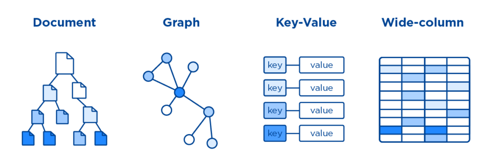

# RDB & NoSQL

## 💡 RDB와 NoSQL의 차이에 대해 설명해 주세요.

|             | RDB(SQL)                                                      | NoSQL                                                                                        |
| ----------- | ------------------------------------------------------------- | -------------------------------------------------------------------------------------------- |
| 데이터 모델 | 테이블                                                        | Document, Key-Value, Column-Family, Graph                                                    |
| 개발 목적   | 데이터 중복 방지                                              | 애자일 / 확장가능성 / 수정가능성                                                             |
| 확장성      | 수직적 확장에 용이                                            | 수평적 확장에 용이                                                                           |
| 스키마      | 엄격한 데이터 구조                                            | 유연한 데이터 구조                                                                           |
| 트랜잭션    | ACID 트랜잭션을 지원                                          | CAP이론을 기반으로 함                                                                        |
| 장점        | 명확한 데이터 구조, 데이터 중복이 없어 update 용이            | 유연한 데이터 구조, 새로운 필드 추가가 자유로움, 수평적 확장(Scale out)용이                  |
| 단점        | 시스템이 커지면 쿼리가 복잡함, 비용이 큰 수직적 확장에 적합함 | 데이터 중복 발생 가능으로 update시 모든 컬렉션 수정 필요, 명확한 데이터 구조를 보장하지 않음 |
| 예시        | Oracle, MySQL, PostgreSQL 등                                  | MongoDB, DynamoDB, CassandraDB 등                                                            |

### 관계형 데이터베이스(RDB)

- **데이터 구조** : 테이블 형태로 데이터를 저장하며, 각 테이블은 `레코드(행)`와 `속성(열)`으로 구성됩니다. 테이블 간의 관계는 외래키(Foreign Key)를 사용하여 정의됩니다.
- **데이터 스키마** : 엄격한 스키마를 가집니다. 데이터의 구조와 타입을 미리 정의해야 하며, 데이터의 변경이 필요한 경우 스키마 변경이 복잡할 수 있습니다.
- **쿼리 언어**: 대표적인 쿼리 언어로 SQL(Structured Query Language)을 사용합니다. SQL을 이용하여 데이터를 조회, 수정, 삭제할 수 있습니다.
- **트랜잭션**: ACID 원칙(원자성, 일관성, 고립성, 지속성)을 준수하여 데이터의 일관성과 무결성을 보장합니다.
- **스케일링** : 수평적 확장이 어려워서 대부분 수직적 확장을 사용합니다. 대용량 트래픽 처리에 어려움이 있을 수 있습니다.

### NoSQL 데이터베이스(NoSQL)

- **데이터 구조**: 다양한 형태의 데이터 모델을 사용합니다. 키-값, 문서, 열 지향, 그래프 등 다양한 데이터 모델이 있습니다.
- **데이터 스키마**: 유연한 스키마를 가지며, 필요한 속성을 동적으로 추가할 수 있습니다. 스키마 변경이 간단하며, 다양한 형태의 데이터를 수용할 수 있습니다.
- **쿼리 언어**: SQL 대신 데이터베이스마다 다양한 쿼리 언어를 사용합니다. 예를 들어, MongoDB는 자체 쿼리 언어를 사용합니다.
- **트랜잭션**: 몇몇 NoSQL 데이터베이스는 ACID 원칙을 준수하거나, 비교적 느슨한 일관성 모델(Consistency Model)을 따릅니다. 그러나 모든 NoSQL 데이터베이스가 이를 보장하지는 않습니다.
- **스케일링**: 수평적 확장이 용이합니다. 대용량 데이터 처리와 분산 환경에서 유리한 성능을 보일 수 있습니다.

`관계형 데이터베이스`는 **정형화된 데이터**와 **복잡한 관계**를 다루는 데 유리하며, 데이터 일관성과 무결성을 중요시하는 경우에 적합합니다. 반면 `NoSQL 데이터베이스`는 **비정형** 또는 **반정형** 데이터, 대용량 데이터 처리, 빠른 확장 등의 경우에 유용합니다. 따라서 데이터베이스 선택은 사용하는 데이터의 특성과 요구사항에 따라 결정되어야 합니다.

 

## 📑 꼬리질문

### NoSQL의 강점과, 약점이 무엇인가요?

- **강점**
  - `유연한 데이터 모델링`이 가능합니다. 데이터의 구조를 동적으로 조정할 수 있고, 이로 인해 `수평적 확장`이 용이합니다.
  - 빅 데이터, 로그 데이터, 센서 데이터 등과 같은 **대량의 데이터**를 다루는 데 용이합니다. NoSQL은 **`분산 아키텍처`**를 강조해, 데이터를 여러 노드로 분산 저장하고 처리하기 때문입니다.
  - `빠른 읽기와 쓰기` 성능을 제공합니다.
- **약점**
  - 데이터베이스 `일관성에 약합니다`. 이 일관성을 가용성, 분할 용인, 속도와 맞바꾸었다고 볼 수 있습니다.
  - 스키마가 정해져 있지 않아, 데이터에 대한 `규격화가 되어 있지 않습니다`.
  - 데이터가 `여러 컬렉션(테이블)에 중복`되어 있어서 데이터를 `UPDATE 하는 경우 모든 컬렉션에서 수행`해야하기 때문에 느리고 작업이 번거롭습니다.
  - ACID 트랜잭션을 지원하지 않거나, 제한적으로 지원하기 때문에 데이터 일관성이나 트랜잭션 처리가 중요한 경우 주의가 필요합니다.

### RDB의 어떠한 특징 때문에 NoSQL에 비해 부하가 많이 걸릴 수 있을까요?

RDB의 정규화된 `스키마`, `ACID 트랜잭션`, `Scalability` 등이 NoSQL에 비해 부하가 많이 걸릴 수 있는 요인입니다.

1. `정규화된 스키마`

   - **RDB는 데이터 정규화를 통해 중복을 최소화하고 데이터의 일관성을 유지합니다.** 하지만 이로 인해서 데이터 조회 시, 여러 테이블을 조인해야 할 수 있는데, 이러한 조인 연산은 성능에 부하를 줄 수 있습니다.

2. `ACID 트랜잭션`

   - **RDB는 트랜잭션을 지원하여 데이터의 일관성과 무결성을 보장합니다**. 하지만 트랜잭션 처리에는 추가적인 오버헤드가 따르며, 동시에 여러 트랜잭션이 처리되는 상황에서 락(lock) 문제로 인해 성능 저하가 발생할 수 있습니다.

3. `Scalability`

   - **RDB의 엄격한 스키마로 인해 수평적 확장이 어렵기 때문입니다.** RDB에서는 일반적으로 여러 테이블이 한 서버에 존재하며 이로 인해 해당 서버에 디스크 및 네트워크 I/O가 집중되면 데이터 베이스에 부하를 발생시킬 수 있습니다.

### NoSQL을 활용한 경험이 있나요? 있다면, 왜 RDB를 선택하지 않고 해당 DB를 선택했는지 설명해 주세요.

- Yes

  - ElasticSearch를 사용해본 경험이 있습니다. 로그를 수집하고 데이터를 분석 및 시각화하기 위해서 사용했었으며 WSGI 서버에 따라 들어오는 데이터의 형태가 달라도 스키마가 정의되어있지 않기 때문에 데이터의 저장이 용이하고 Elastic Search 자체의 inverted-index 기능은 데이터의 분석을 용이하게 해주기 때문에 이를 위해서 NoSQL 사용했었습니다.

- No

  - NoSQL을 활용한 경험은 없지만, 다음과 같은 경우라면 NoSQL을 사용할 것 같습니다.

    1. **대용량 및 빠른 데이터 처리**: 대량의 데이터를 빠르게 읽고 쓰는 것이 필요한 경우
       (ex. 웹 어플리케이션, 소셜 미디어 플랫폼, 로그 처리 등에서 데이터 양이 급증하는 상황 등)
    2. **비정형 또는 반정형 데이터**: 다양한 형태의 비정형 데이터(텍스트, 이미지, 동영상 등)를 저장하고 처리해야 하는 경우. 문서 형태의 데이터나 JSON, XML과 같은 데이터 포맷을 다루는 데 용이하기 때문입니다.

    - 특히 ML/DL 학습 과정에 활용할 학습 데이터를 NoSQL에 저장하면 비정형 데이터를 다룰 수 있다는 이점과, 대량의 데이터를 빠르게 조회할 수 있다는 이점, 신규 데이터를 확보하게 된 경우 시스템을 수평적으로 확장할 수 있다는 이점이 있을 것 같습니다.
       

## 🐍 꼬꼬무

### RDB를 쓰는 게 더 좋은 상황과 NoSQL을 쓰는 게 더 좋은 상황은 언제인가요?

**RDB 사용이 더 좋을 때**

- 관계를 맺고 있는 데이터가 자주 변경되는 애플리케이션의 경우
- 변경될 여지가 없고, 명확한 스키마가 사용자와 데이터에게 중요한 경우

**NoSQL 데이터베이스 사용이 더 좋을 때**

- 정확한 데이터 구조를 알 수 없거나 변경/확장 될 수 있는 경우
- 읽기를 자주 하지만, 데이터 변경은 자주 없는 경우
- 데이터베이스를 수평으로 확장해야 하는 경우 (막대한 양의 데이터를 다뤄야 하는 경우)
   

## 📚 Reference

[티스토리 - RDBMS의 한계와 NoSQL을 사용하는 이유 (3) NoSQL 장단점, 특징](https://sujl95.tistory.com/83)

[깃허브 - <데이터베이스> 관계형 vs. NoSQL 언제 무엇을 써야할까?](https://ud803.github.io/%EB%8D%B0%EC%9D%B4%ED%84%B0%EB%B2%A0%EC%9D%B4%EC%8A%A4/2021/11/16/RDB-vs.-NoSQL-%EC%96%B8%EC%A0%9C-%EB%88%84%EA%B5%AC%EB%A5%BC-%EC%8D%A8%EC%95%BC%ED%95%A0%EA%B9%8C/)

[깃허브 - SQL과 NOSQL의 차이](https://gyoogle.dev/blog/computer-science/data-base/SQL%20&%20NOSQL.html)

[티스토리 - RDB와 NoSQL의 차이는?](https://hyuuny.tistory.com/158)

[데이터온에어 - 데이터실무](https://dataonair.or.kr/db-tech-reference/d-guide/data-practical/?mod=document&uid=388)

[미디엄 - Differences Between SQL And NoSQL: Is NoSQL Faster Than SQL?](https://dmai287.medium.com/differences-between-sql-and-nosql-525a0796b901)

[미디엄 - [Elastic Search] 기본 개념과 특징(장단점)](https://jaemunbro.medium.com/elastic-search-%EA%B8%B0%EC%B4%88-%EC%8A%A4%ED%84%B0%EB%94%94-ff01870094f0)
