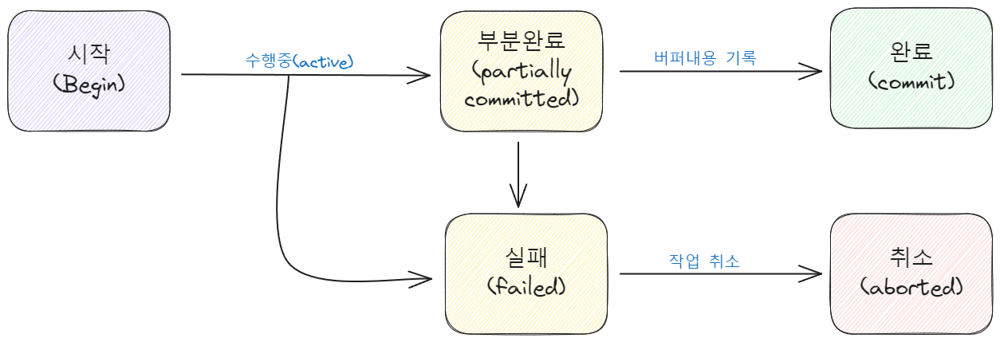
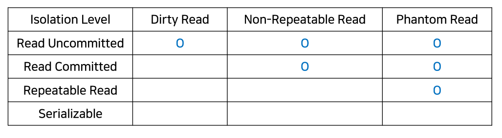
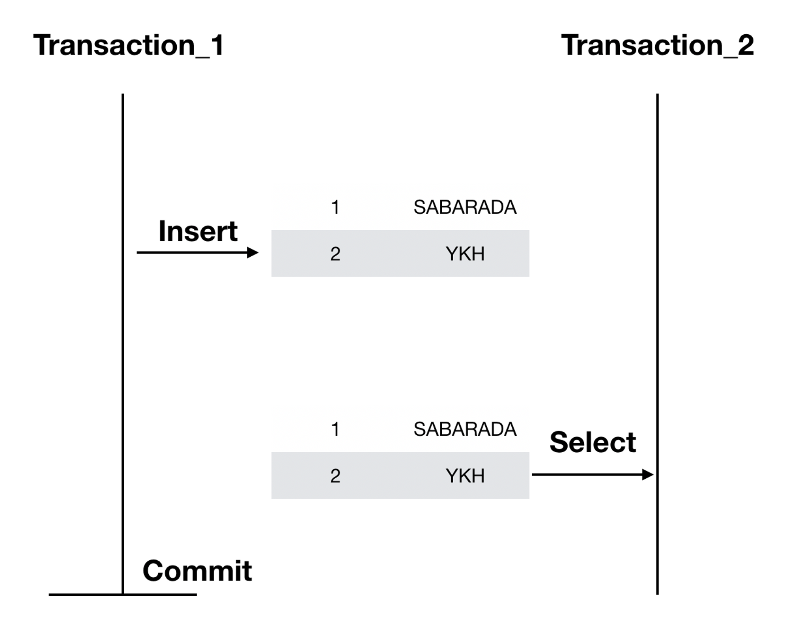
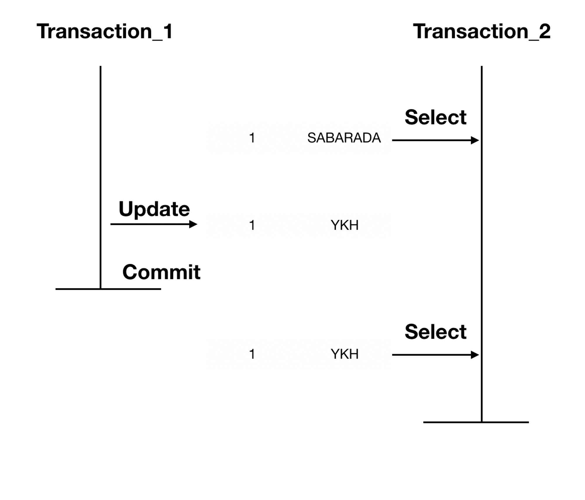
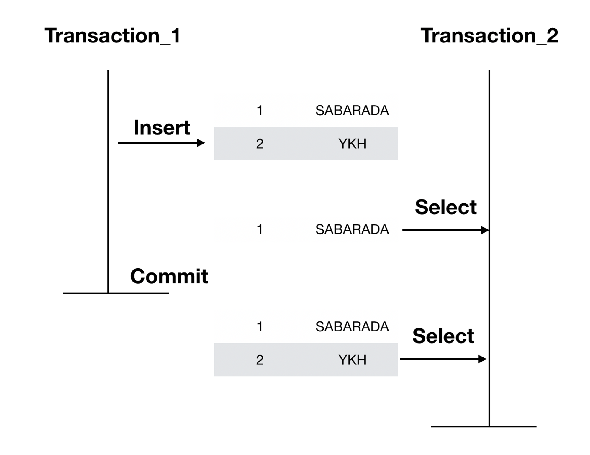
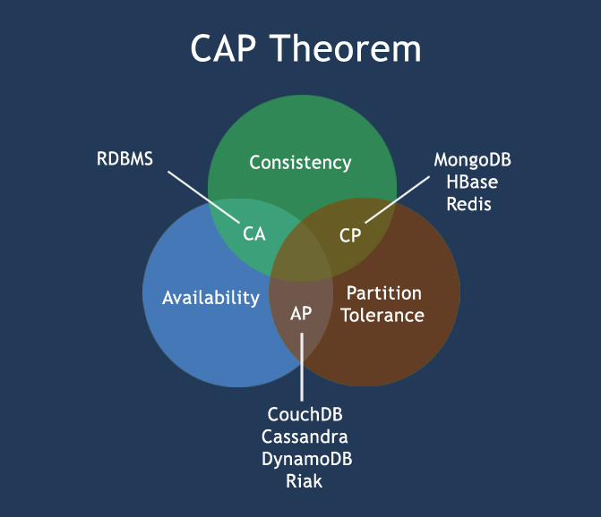

# 키워드 제목
## 💡 트랜잭션이 무엇인지와, ACID 원칙에 대해 설명해주세요.
- **`트랜잭션`** 은 DBMS에서 논리적 기능을 수행하기 위한 작업의 단위를 의미합니다.
- ACID원칙은 트랜잭션이 DBMS에서 안전하게 수행되도록 보장하기 위한 성질을 의미하는 4가지 원칙의 약어입니다.
    - **`원자성(Atomicity)`** : 트랜잭션에 포함된 작업은 전부 수행되거나 아니면 전부 수행되지 않아야 합니다. (all or nothing)
    - **`일관성(Consistency)`** : 트랜잭션을 수행하기 전이나 수행한 후나 데이터베이스는 항상 일관된 상태를 유지해야 합니다.
    - **`독립성(Isolation)`** : 트랜잭션을 수행 시 다른 트랜잭션의 연산 작업이 끼어들지 못하도록 보장해야 합니다.
    - **`지속성(Durability)`** : 수행을 성공적으로 완료한 트랜잭션은 변경한 데이터를 영구히 저장해야 합니다. 저장된 데이터 베이스는 저장 직후 혹은 어느 때나 사용자 또는 시스템에 발생할 수 있는 장애, 오류에 영향을 받지 않아야 합니다.

## 📑 꼬리질문
### ACID 원칙 중, Durability를 DBMS는 어떻게 보장하나요?
해당 트랜잭션에 대한 로그를 남겨놓는 방식으로 Durability를 보장할 수 있습니다.

**`Write-Ahead Logging (WAL)`:** 대부분의 관계형 데이터베이스 관리 시스템(RDBMS)에서는 Write-Ahead Logging을 사용하여 내구성을 보장합니다. 이 방법에서는 **트랜잭션이 커밋되기 전에 해당 변경 사항을 로그 파일에 먼저 기록한 후, 데이터 파일에 변경 사항을 적용**합니다. 따라서 트랜잭션을 커밋하기 전에 로그에 기록되어 있는 **모든 변경 사항은 시스템 장애 시에도 복구**될 수 있습니다.

### 트랜잭션을 사용해 본 경험이 있나요? 어떤 경우에 사용할 수 있나요?
- 특정 테이블의 잘못된 값을 수정할 때 트랜잭션을 사용해 본 경험이 있습니다.
    1. **잘못된 값 확인**: 먼저 잘못된 값을 확인
    2. **트랜잭션 시작**: 트랜잭션을 시작(START TRANSACTION). 변경 작업을 묶어서 처리
    3. **값 수정**: 잘못된 값을 올바른 값으로 수정
    4. **커밋**: 변경 작업이 완료되었을 경우, 트랜잭션을 커밋하여 변경 사항을 영구적으로 반영
    5. **롤백(옵션)**: 만약 변경 작업 중에 문제가 발생하여 트랜잭션을 취소해야 할 경우, 롤백을 수행하여 원래의 상태로 되돌림.

- DB의 데이터를 추가하기 위해서 사용할 수 있습니다. 웹 서버에서 POST로 받은 요청이 유저의 장바구니에 상품을 담는다고 가정하였을 때 해당 유저의 장바구니 테이블에 상품의 PK 값을 추가하는 쿼리를 작성하였습니다.
    1. 특정 상품을 상품 테이블에서 조회 후 PK 값 확인
    2. 특정 유저를 유저 테이블에서 조회 후 PK 값 확인
    3. 유저와 상품의 관계를 정의하는 장바구니 테이블에 각각의 PK 값을 Foreign Key로 사용하여 레코드 추가

- 이외에도, 작업을 수행하기 위해 여러 쿼리를 실행해야 할 때, 각 쿼리의 성공 유무가 다른 쿼리의 결과에 critical한 영향을 미치는 경우(예를 들어, 계좌 입/출금 등의 경우)에 트랜잭션을 활용할 수 있습니다.

### 읽기에는 트랜잭션을 걸지 않아도 될까요?
데이터 읽기 작업에서도 사용자가 데이터를 일관성있게 읽어들이려면 트랜잭션을 걸어야합니다.

## 🐍 꼬꼬무
### 트랜잭션의 수행 과정이 어떻게 되나요?

트랜잭션 수행을 완료하면 **부분완료** 또는 **실패** 상태 중 하나가 됩니다. DBMS는 부분완료 상태에서는 작업한 내용을 데이터베이스에 반영하고, 실패 상태에서는 작업한 내용을 취소합니다. 

- `부분완료`: 트랜잭션 수행은 완료됐지만 변경 내용이 데이터 베이스에 기록됐는지 확실하지 않은 상태입니다. 이 상태에서는 DBMS가 최종적으로 변경 내용을 데이터베이스에 기록해야 완료 상태(지속성)가 됩니다.
- `실패`: 트랜잭션을 중간에 중단하였거나 부분완료 상태에서 변경 내용을 데이터베이스에 저장하지 못한 상태를 말합니다. 실패 상태에서 DBMS는 트랜잭션이 수행한 작업을 모두 원상복구시킵니다.

### 트랜잭션이 발생한 시점에서 일관성을 유지하도록 하는 것을 무엇이라고 하나요?
트랜잭션이 시작된 시점부터 데이터를 일관성있게 데이터를 읽어들일 수 있도록 하는 것을 `트랜잭션 수준 읽기 일관성`이라고 합니다. 이 때, `트랜잭션 고립화 수준`에 따라 일관성의 정도를 조절할 수 있습니다.

- 트랜잭션 고립화 수준
    

    - 레벨 0 (Read Uncommitted)
        - 트랜잭션에서 처리 중인, 아직 커밋되지 않은 데이터를 다른 트랜잭션이 읽는 것을 허용합니다.
        - Dirty Read, Non-Repeatable Read, Phantom Read 현상이 발생합니다.
    - 레벨 1 (Read Committed)
        - 트랜잭션이 커밋되어 확정된 데이터만 읽는 것을 허용합니다. (Dirty Read 방지)
        - Non-Repeatable Read, Phantom Read 현상은 여전히 발생
    - 레벨 2 (Repeatable Read)
        - 선행 트랜잭션이 읽고 있는 데이터는 해당 트랜잭션이 종료될 때까지 후행 트랜잭션이 갱신, 삭제하는 것을 허용하지 않습니다.
        - Phantom Read 현상은 여전히 발생
    - 레벨 3 (Serializable Read)
        - 선행 트랜잭션이 읽고 있는 데이터는 해당 트랜잭션이 종료될 때까지 후행 트랜잭션이 갱신, 삭제, 삽입하는 것을 허용하지 않습니다.
        - 완벽하게 읽기 일관성 모드를 제공합니다.

### 낮은 단계의 트랜잭션 고립화 수준을 사용할 때 발생하는 세 가지 현상에 대해서 설명해주세요.
`Dirty Read`

**Dirty Read는 다른 트랜잭션에 의해 수정됐지만 아직 커밋되지 않은 데이터를 읽는 것**을 말합니다. 위 예시를 보면, Transaction_1이 정상처리되지 않고 Rollback될 수 있습니다. 이럴 경우 그 값을 이미 읽은 Transaction_2는 잘못된 값을 가지고 본인의 로직을 처리하는 상태에 놓이게 됩니다.

`Non-Repeatable Read`

**Non-Repeatable Read는 한 트랜잭션 내에서 같은 Key를 가진 Row를 두 번 읽었는데 그 사이에 값이 변경되거나 삭제되어 결과가 다르게 나타나는 현상**을 말합니다.

`Phantom Read`

**Phantom Read는 한 트랜잭션 내에서 같은 쿼리를 두 번 수행했는데, 첫 번째 쿼리에서 없던 유령(Phantom) 레코드가 두 번째 쿼리에서 나타나는 현상**을 말합니다.

### CAP 원칙에 대해서 설명해주세요.

- CAP 원칙은 분산 컴퓨팅 환경에서의 DBMS의 성능과 안정성을 설명하는 개념으로, `일관성`, `가용성`, `분할 내성` 중 세 가지 요소를 모두 만족하는 시스템은 존재하지 않음을 증명한 정리입니다.
    - **`일관성(Consistency)`** : 모든 노드는 동일한 순간의 데이터를 볼 수 있도록 보장합니다. 즉, 한 노드에서 데이터가 변경되면 다른 모든 노드에서도 같은 데이터 변경이 반영되어야 합니다.
    - **`가용성(Availability)`** : 모든 요청에 대해 성공이나 실패에 대한 응답을 받도록 보장합니다. 시스템이 어떤 노드의 장애나 오류로 인해 작동하지 않더라도 다른 노드가 계속 서비스를 제공할 수 있어야 합니다.
    - **`분할 내성(Partition Tolerance)`** : 네트워크 분할 등으로 인해 노드 간의 통신이 실패하거나 지연되더라도 시스템이 지속될 수 있도록 보장합니다. 네트워크는 항상 신뢰할 수 없으므로 이는 많은 경우에 반드시 필요로 합니다.
- 조합 별 특징
    - **`CA`** : 분할 내성을 포기하고 일관성과 가용성을 확보합니다. 이는 **전통적인 관계형 데이터베이스**에 해당됩니다.
    - **`CP`** : 가용성을 포기하고 일관성과 분할 내성을 확보합니다. **원자성 읽기와 쓰기 작업을 필요로 하는 비즈니스 로직 등 높은 일관성을 요구하는 상황**에 적합합니다.
    - **`AP`** : 일관성을 포기하고 가용성과 분할 내성을 선택합니다. **분산 시스템에서 빠른 응답과 안정성을 요구하는 상황**에 적합합니다.

 

## 📚 Reference
[구루비 - 트랜잭션 수준 일관성](http://wiki.gurubee.net/pages/viewpage.action?pageId=21200923)

[데이터온에어 - DBMS 1](https://dataonair.or.kr/db-tech-reference/d-guide/dbms-1/?mod=document&uid=101732)

[링크드인 - Maintaining database atomicity and durability with write-ahead logging](https://www.linkedin.com/pulse/maintaining-database-atomicity-durability-write-ahead-gaurav-pandey/)

[블로그 - [데이터베이스] 트랜잭션의 ACID 성질](https://hanamon.kr/%EB%8D%B0%EC%9D%B4%ED%84%B0%EB%B2%A0%EC%9D%B4%EC%8A%A4-%ED%8A%B8%EB%9E%9C%EC%9E%AD%EC%85%98%EC%9D%98-acid-%EC%84%B1%EC%A7%88/)

[스택오버플로우 - [Should there be a Transaction for Read Queries?]](https://stackoverflow.com/questions/308905/should-there-be-a-transaction-for-read-queries)

[티스토리 - 📚 트랜잭션(Transaction) 개념 & 사용 💯 완벽 정리](https://inpa.tistory.com/entry/MYSQL-%F0%9F%93%9A-%ED%8A%B8%EB%9E%9C%EC%9E%AD%EC%85%98Transaction-%EC%9D%B4%EB%9E%80-%F0%9F%92%AF-%EC%A0%95%EB%A6%AC)

[티스토리 - [시스템 디자인] CAP 이론 정리](https://whatsupmedia.tistory.com/22)

[티스토리 - 트랜잭션(Transaction)이란?](https://jins-dev.tistory.com/entry/Database-%ED%8A%B8%EB%9E%9C%EC%9E%AD%EC%85%98%EC%9D%84-%EC%9C%84%ED%95%9C-ACID-%EC%9D%98-%EA%B0%9C%EB%85%90)

[티스토리 - Database 트랜잭션을 위한 ACID의 개념](https://jins-dev.tistory.com/entry/Database-%ED%8A%B8%EB%9E%9C%EC%9E%AD%EC%85%98%EC%9D%84-%EC%9C%84%ED%95%9C-ACID-%EC%9D%98-%EA%B0%9C%EB%85%90)

[티스토리 - [SQL] WAL 이란 무엇인가?](https://eyeballs.tistory.com/514)

[티스토리 - [데이터베이스] 트랜잭션과 격리성](https://sabarada.tistory.com/117)
