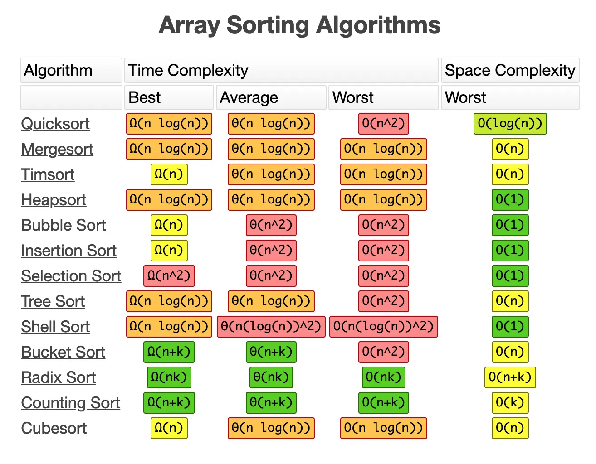

# 정렬 알고리즘

## 💡 각종 정렬 알고리즘을 구현해보세요.

### 버블 정렬(Bubble Sort)

<p align="center"></p>

- 인접한 두 원소를 비교하여 필요 시 위치를 교환하는 과정을 N번 반복합니다.
- 구현은 쉽지만 효율성이 매우 낮다고 알려져 있습니다.
- 시간복잡도는 $O(N^2)$ 로, worst,average,best case 모두 동일합니다.

```python
def bubble_sort(array: List[int]) -> None:  # 제자리 정렬
    N = len(array)
    for i in range(N):
        for j in range(0, N-i-1):   # i번째 순회할 때마다 뒤에서 i번째 원소는 제자리를 찾아감
            if array[j] > array[j+1]:
                array[j], array[j+1] = array[j+1], array[j]
```

### 선택 정렬(Selection Sort)

<p align="center"></p>

- 선택 정렬은 배열에서 작은 데이터를 선별하여서 데이터를 앞으로 보내는 정렬의 일종으로 효율성이 낮습니다.
- 시간복잡도: $O(N^2)$ 로, worst,average,best 모두 동일합니다.

```python
def selection_sort(arr:List[int]) -> None:
    n = len(arr)
    for i in range(n):
        min_idx = i
        for j in range(i + 1, n):
            if arr[min_idx] > arr[j]:
                min_idx = j
        arr[i], arr[min_idx] = arr[min_idx], arr[i]
```

### 삽입 정렬(Insertion Sort)

<p align="center"></p>

- 삽입 정렬은 자료 배열의 모든 요소를 앞에서부터 차례대로 이미 정렬된 배열 부분과 비교하여, 자신의 위치를 찾아 삽입함으로써 정렬을 완성하는 알고리즘입니다.
- 시간복잡도: $O(N^2)$:worst,average, $O(N)$: 이미 정렬되어 있다면 best

```python
def insertion_sort(array: List[int]) -> None:
    for end in range(1, len(array)):
        for i in range(end, 0, -1):
            if array[i - 1] > array[i]:
                array[i - 1], array[i] = array[i], array[i - 1]
```

_for문을 사용한 code_

```python
def insertion_sort(array: List[int]) -> None:   # 제자리 정렬
    N = len(array)

    for i in range(1, N):
        key = array[i]  # key 기억
        j = i-1  # key 이전 인덱스와 key 비교
        while j >= 0 and key < array[j]:    # 위치 찾을 때까지
            array[j+1] = array[j]           # 오른쪽 시프트
            j -= 1
        array[j+1] = key                    # 찾은 위치에는 기억한 key 삽입
```

_while문을 사용한 code_

### 퀵 정렬(Quick Sort)

<p align="center"></p>

- 데이터 집합내에 임의의 기준(pivot)값을 정하고 해당 피벗으로 집합을 기준으로 두개의 부분 집합으로 나눈 후 한쪽 부분에는 피벗값보다 작은값들만, 다른 한쪽은 큰값들만 넣습니다. 더 이상 쪼갤 부분 집합이 없을 때까지 각각의 부분 집합에 대해 피벗/쪼개기 재귀적으로 적용합니다.
- 시간복잡도
  - average, best : $O(NlogN)$
  - worst : $O(N^2)$

```python
def quick_sort(array: List[int]) -> None:
    N = len(array)

    def sort(low, high):
        if high <= low:
            return
        mid = partition(array, low, high)
        sort(low, mid - 1)
        sort(mid, high)

    def partition(array, low, high):
        pivot = array[(low + high) // 2]  # 가운데 값 피벗 설정
        while low <= high:
            while array[low] < pivot:
                low += 1
            while array[high] > pivot:
                high -= 1
            if low <= high:
                array[low], array[high] = array[high], array[low]
                low, high = low + 1, high - 1
        return low

    sort(0, N-1)
```

_pseudo code_

```python
def quick_sort(arr):
    if len(arr) <= 1:
        return arr

    pivot = arr[len(arr) // 2]

    left = [x for x in arr if x < pivot]
    middle = [x for x in arr if x == pivot]
    right = [x for x in arr if x > pivot]

    return quick_sort(left) + middle + quick_sort(right)
```

_최적화된 코드_

### 합병 정렬

<p align="center"></p>

- 둘 이상의 부분집합으로 가르고, 각 부분집합을 정렬한 다음 부분 집합들을 다시 정렬된 형태로 합치는 방식
- 일반적인 방법으로 구현했을 때 이 정렬은 안정 정렬에 속하며, 분할 정복 알고리즘의 하나입니다.
- 시간복잡도는 $O(NlogN)$으로, worst,average,best 각 케이스 모두 동일합니다.

```python
def merge_sort(array: List[int]) -> List[int]:   # 제자리 정렬 x

    def sort(array):
        """
        1. 가장 작은 단위(원소 1개)가 될 때까지 입력 배열을 2 개의 부분 배열로 분할
        2. 정렬하며 결합 (merge 함수 호출)
        """
        N = len(array)

        if N <= 1:
            return array

        mid = N//2
        left = sort(array[:mid])
        right = sort(array[mid:])

        return merge(left, right)

    def merge(left, right):
        """
        부분 배열을 정렬하면서 결합
        """
        sorted_list = []
        i, j = 0, 0

        # 정렬하면서 결합
        while i < len(left) and j < len(right):
            if left[i] < right[j]:
                sorted_list.append(left[i])
                i+=1
            else:
                sorted_list.append(right[j])
                j+=1

        # 두 부분 배열의 남은 부분 이어붙이기
        if i < len(left):
            sorted_list += left[i:]
        if j < len(right):
            sorted_list += right[j:]

        return sorted_list

    return sort(array)

```

_pseudo code_

```python
def merge_sort(array: List[int]) -> None:
    if len(array) < 2:
        return array

    mid = len(array) // 2
    left = merge_sort(array[:mid])
    right = merge_sort(array[mid:])

    merged_arr = []
    l = r = 0
    while l < len(left) and r < len(right):
        if left[l] < right[r]:
            merged_arr.append(left[l])
            l += 1
        else:
            merged_arr.append(right[r])
            r += 1

    merged_arr += left[l:]
    merged_arr += right[r:]
    return merged_arr
```

_최적화된 코드_

### 힙 정렬(Heap Sort)

<p align="center"></p>

- 힙 정렬이란 최대 힙 트리나 최소 힙 트리를 구성해 정렬을 하는 방법으로서, 내림차순 정렬을 위해서는 최소 힙을 구성하고 오름차순 정렬을 위해서는 최대 힙을 구성하면 됩니다.
- 시간복잡도: $O(NlogN)$ worst,average,best 모두 동일

```python
def heap_sort(arr:List[int]) -> List[int]:
    def heapify(arr, n, i):
        """
        힙 형태로 변환
        """
        largest = i
        l = 2 * i + 1
        r = 2 * i + 2

        if l < n and arr[i] < arr[l]:
            largest = l

        if r < n and arr[largest] < arr[r]:
            largest = r

        if largest != i:
            arr[i], arr[largest] = arr[largest], arr[i]
            heapify(arr, n, largest)

    n = len(arr)
    for i in range(n, -1, -1):
        heapify(arr, n, i)

    for i in range(n-1, 0, -1):
        arr[i], arr[0] = arr[0], arr[i]
        heapify(arr, i, 0)

    return arr
```

### 계수 정렬(Counting Sort)

<p align="center"></p>

- 계수 정렬 또는 카운팅 소트는 컴퓨터 과학에서 정렬 알고리즘의 하나로서, 작은 양의 정수들인 키에 따라 객체를 수집하는 것, 즉 정수 정렬 알고리즘의 하나입니다.
- 시간 복잡도: $O(N+K)$

```python
def counting_sort(array: List[int]) -> List[int]:   # 제자리 정렬 x
    count_array = [0 for _ in range(max(array)+1)]

    # 카운팅
    for num in array:
        count_array[num]+=1

    # 누적합으로 갱신
    for i in range(1, len(count_array)):
        count_array[i] += count_array[i-1]

    result = [0 for _ in range(len(array))]

    # 누적합 인덱스와 값 참조해서 새로운 배열의 정렬 위치에 삽입하기
    for num in array:
        idx = count_array[num]
        result[idx-1] = num
        count_array[num] -= 1

    return result
```

### 기수 정렬(Radix Sort)

<p align="center"></p>

- 기수 정렬은 낮은 자리 수부터 비교해가며 정렬합니다. 비교연산을 하지 않아 빠르지만, 또 다른 메모리 공간을 필요하다는게 **단점** 입니다.
- 기수정렬은 낮은 자리수부터 비교하여 정렬해 간다는 것을 기본 개념으로 하는 정렬 알고리즘입니다.
- 기수정렬은 비교 연산을 하지 않으며 정렬 속도가 빠르지만 데이터 전체 크기에 기수 테이블의 크기만한 메모리가 더 필요합니다.
- 시간복잡도: $O(dN)$

```python
def radix_sort(arr):
    RADIX = 10
    placement = 1

    max_digit = max(arr)

    while placement < max_digit:
        buckets = [list() for _ in range(RADIX)]

        for i in arr:
            tmp = int((i / placement) % RADIX)
            buckets[tmp].append(i)

        a = 0
        for b in range(RADIX):
            buck = buckets[b]
            for i in buck:
                arr[a] = i
                a += 1

        placement *= RADIX
```

_버킷을 사용하여 구현_

```python
def counting_sort(arr, exp):
    n = len(arr)
    output = [0] * n
    count = [0] * 10

    for i in range(n):
        index = arr[i] // exp
        count[index % 10] += 1

    for i in range(1, 10):
        count[i] += count[i - 1]

    i = n - 1
    while i >= 0:
        index = arr[i] // exp
        output[count[index % 10] - 1] = arr[i]
        count[index % 10] -= 1
        i -= 1

    for i in range(n):
        arr[i] = output[i]

def radix_sort(arr):
    max_value = max(arr)
    exp = 1

    while max_value // exp > 0:
        counting_sort(arr, exp)
        exp *= 10
```

_계수 정렬을 사용하여 구현_

<p align="center"></p>

<br>

## 📑 꼬리질문

### 파이썬의 sort는 어떤 정렬 알고리즘을 사용하나?

2002년 소프트웨어 엔지니어 Tim Peters에 의하여 Tim sort가 등장했다. 이 정렬 알고리즘은 Insertion sort와 Merge sort를 결합하여 만든 정렬로 Python, Java SE 7, Android, Google chrome (V8), 그리고 swift까지 많은 프로그래밍 언어에서 표준 정렬 알고리즘으로 채택되어 사용되고 있습니다.

[[Tim Sort - Python]](https://github.com/python/cpython/blob/ba18c0b13ba3c08077ea3db6658328523823a33f/Objects/listobject.c#L1051)

<br>

## 🐍 꼬꼬무

### Tim Sort는 왜 Insertion Sort와 Merge Sort를 결합했을까?

<p align="center"></p>

<br>

Tim sort는 Merge sort를 기반으로 하되, 좀 더 효율적으로 run을 나누고 제각기 다른 크기를 가진 run을 최대한 효율적인 방법으로 병합하며 실생활 데이터의 특성을 이용하여 여러 가지 최적화 기법을 도입한 정렬 알고리즘입니다.

완전히 무작위인 데이터에 대해서는 속도가 빠른 편은 아니지만 일정한 패턴이 있는 일반적인 데이터에 대해서는 빠른 성능을 보여주고 안정적이며 최악의 시간 복잡도가 $O(nlogn)$이기에 지금까지도 많은 언어에서 표준 정렬 알고리즘으로 채택하여 사용하고 있습니다.

<br>

## 📚 Reference

[네이버 블로그 - Tim sort에 대해 알아보자](https://d2.naver.com/helloworld/0315536)

[티스토리 - 정렬 알고리즘의 선택과 종류 7가지](https://hyo-ue4study.tistory.com/68)

[chatGPT](<[https://chat.openai.com](https://chat.openai.com/)>)
