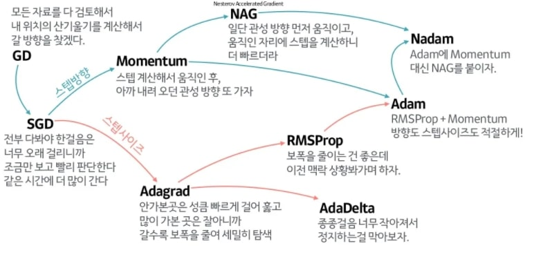
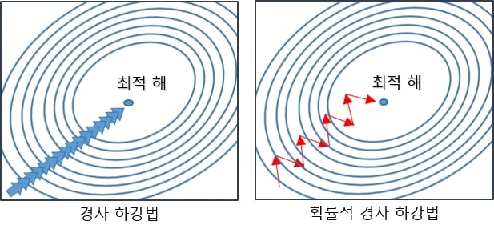
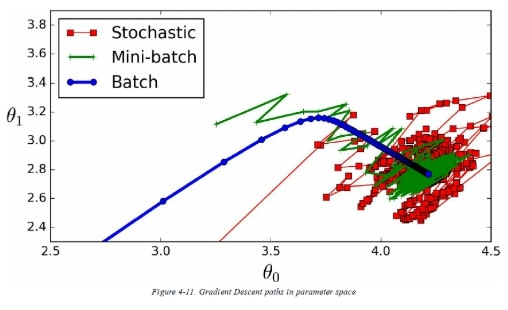
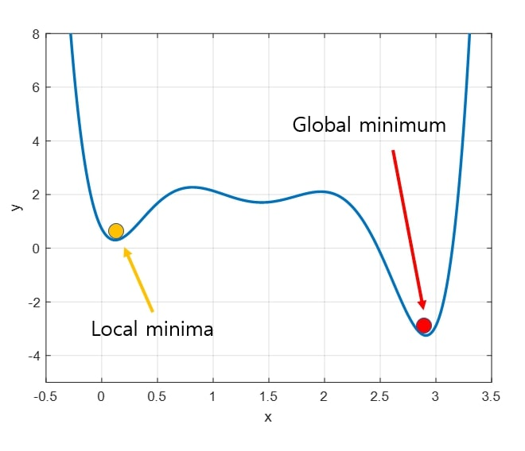

# Gradient Descent
## 💡 Gradient Descent란?
<p align="center"></p>

`경사 하강법(Gradient Descent)`은 비용 함수를 최소화하기 위해 파라미터($\theta$)에 대한 비용함수의 현재 그레디언트가 감소하는 방향으로 파라미터를 조정하는 방법입니다.
$$\theta^{\text (next\ step)} = \theta-\eta\nabla_\theta LOSS(\theta)$$
- $\theta$ : 조정할 파라미터
- $\eta$ : 학습률
- $\nabla_\theta LOSS(\theta)$ : $\theta$에 대한 비용함수의 그레디언트 벡터

<동작 방식>
1. 초기화: 먼저 최적화하려는 함수의 시작점을 초기화합니다. 이 초기화 단계에서는 보통 가중치와 편향을 무작위로 설정하거나 작은 값으로 초기화합니다.
2. 기울기 계산: 주어진 위치에서 함수의 기울기(gradient)를 계산합니다. 기울기는 해당 위치에서 함수 값이 가장 빠르게 증가 또는 감소하는 방향과 크기를 나타냅니다.
3. 업데이트: 계산된 기울기를 이용하여 현재 위치에서 조금 더 최솟값 쪽으로 이동합니다. 이동 거리는 사용자가 설정한 학습률(learning rate)에 의해 결정됩니다. 
4. 반복: 위 과정을 여러 번 반복하여 최적화하려는 함수의 최솟값에 점차 수렴합니다. 기울기를 계산하고 업데이트하는 과정을 반복하면서 최적의 파라미터(가중치와 편향)를 찾습니다.


<br>

## 📑 꼬리질문
### Local Minima 문제에도, Gradient Descent가 사용될 수 있는 이유는 무엇인가요?
- [논문](https://proceedings.neurips.cc/paper_files/paper/2014/hash/17e23e50bedc63b4095e3d8204ce063b-Abstract.html)에 따르면, 고차원에서 weight의 모든 요소가 local minima에 빠지는 경우는 거의 발생하지 않기 때문에 local minima 문제는 사실상 고차원 발생하기 매우 희귀한 경우라고 주장합니다. 또한, local minima가 발생한다 해도 이는 사실 global minimum이거나 global minimum과 유사한 값을 가지게 되어 문제가 없는 경우가 많습니다.
- Momentum, RMSProp, Adam등의 개선된 Optimizer는 Local Minima를 피하기 위한 수단을 제공합니다.
    <p align="center"></p>

### 비용함수 MSE에 대한 경사하강법을 구현해보세요
1. 비용함수의 편도함수 구하기

$$\frac {\partial} {\partial \theta_j}MSE(\theta) = \frac {2} {m}\sum^m_{i=1}\left(\theta^T {\bf x}^{(i)}-y^{(i)}\right)x^{(i)}_j$$

2. 비용 함수의 그레디언트 벡터 구하기

$$\nabla_\theta MSE(\theta) = \begin{bmatrix} 
{\frac {\partial} {\partial\theta_0}MSE(\theta)} \\
{\frac {\partial} {\partial\theta_1}MSE(\theta)} \\
\vdots \\
{\frac {\partial} {\partial\theta_n}MSE(\theta)}
\end{bmatrix} = \frac {2} {m} {\bf X}^T({\bf X\theta-y})$$

3. 경사하강법 구현하기

$$\theta^{\text (next\ step)} = \theta-\eta\nabla_\theta LOSS(\theta)$$

```python
import numpy as np
X = 2 * np.random.rand(100, 1)
y = 4 + 3 * X + np.random.rand(100, 1)

X_b = np.c_[np.ones((100, 1)), X] # 모든 샘플에 x0 = 1(bias)을 추가

eta = 0.1
epochs = 1000
m = 100

theta = np.random.randn(2,1) # 무작위 초기화

for epoch in range(epochs):
	gradients = 2/m * X_b.T.dot(X_b.dot(theta) - y) # MSE의 그레디언트 구하기
	theta = theta - eta * gradients # 파라미터 업데이트

'''
>>> theta
array([[4.21509616],
			 [2.77011339]])
'''
```
### Batch Gradient Descent, Stochastic Gradient Descent, Mini Batch Gradient Descent를 비교해보세요.
**Batch Gradient Descent(배치 경사 하강법)**

- 매 스텝 전체 훈련 세트에서 경사 하강법을 진행하는 방법으로, 위 알고리즘과 같습니다.
- 따라서 훈련 세트가 커지면 매우 느려지게 된다는 단점이 있습니다.

**Stochastic Gradient Descent(확률적 경사 하강법)**
<p align="center"></p>

- 매 스텝 한 개의 샘플을 무작위로 선택하고, 그 하나의 샘플에 대한 그레디언트를 계산해 경사 하강법을 진행하는 방법입니다.
- 매 스텝에서 다뤄야 할 데이터가 매우 적기 때문에 알고리즘이 훨씬 빠르며, 매 스텝마다 메모리에 해당 샘플만 적재하면 되므로, 훨씬 큰 훈련 세트도 훈련시킬 수 있습니다.
- 하지만 배치 경사 하강법에 비해 훨씬 불안정합니다. loss가 최소값에 수렴할 때까지 부드럽게 감소하지 않고 위아래로 요동치며 평균적으로 감소합니다.

**Mini-Batch Gradient Descent(미니배치 경사 하강법)**
<p align="center"></p>

- 매 스탭 **미니배치**라 부르는 임의의 작은 샘플 세트에 대해 그레디언트를 계산해 경사 하강법을 진행하는 방법입니다.
- 확률적 경사 하강법에 비해 GPU의 병렬 처리 연산으로 얻는 성능 향상이 있을 수 있습니다.
- 배치 경사 하강법보다 빠르고, SGD보다 낮은 오차율을 가지기 때문의 두 방법을 절충한 방법으로 생각할 수 있습니다.
<br>

## 🐍 꼬꼬무
### 손실 함수는 무엇인가요?
지도학습(Supervised Learning) 시 알고리즘이 예측한 값과 실제 정답의 차이를 비교하기 위한 함수입니다. 즉, '학습 중에 알고리즘이 얼마나 잘못 예측하는 정도'를 확인하기 위한 함수로써 최적화(Optimization)를 위해 최소화하는 것이 목적인 함수입니다. 그래서 `손실 함수`를 `목적 함수(Objective Function)`라고도 부릅니다. 이외에도 손실 함수는 분야에 따라 `비용 함수(Cost Function)`, `에너지 함수(Energy Function)` 등으로 다양하게 부르기도 합니다. 손실 함수를 통해 모델 학습 중에 손실(loss)이 커질수록 학습이 잘 안 되고 있다고 해석할 수 있고, 반대로 손실이 작아질수록 학습이 잘 이루어지고 있다고 해석합니다.

### Learning Rate(LR)이 왜 중요한가요?
<p align="center"></p>

- 파라미터 값을 업데이트 하는 Step Size를 LR라는 하이퍼 파라미터로 매우 중요하게 조정 되어야 합니다.
- 너무 큰 값을 주게 되었을 때는 수렴 속도가 빨라질 수 있지만 최소값을 계산하도록 수렴하지 못하고 minina 지점을 스킵 할 수 있게 됩니다.
- 너무 작은 값을 주게 된다면 학습 속도가 굉장히 느려지며 local minima에 빠져 학습이 원활하게 진행되지 못하게 됩니다.
<br>

## 📚 Reference
- [핸즈온 머신러닝 2판 - 4장 모델 훈련]
- [티스토리 - Gradient Descent 탐색 방법](https://darkpgmr.tistory.com/133) 
- [티스토리 - [Deep Learning] 확률적 경사 하강법(Stochastic Gradient Descent)](https://go-hard.tistory.com/11)
