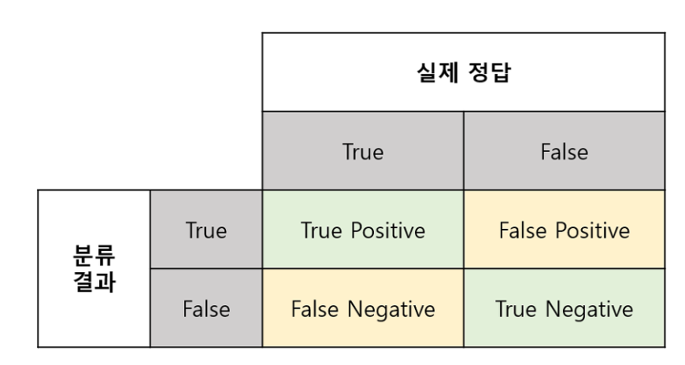
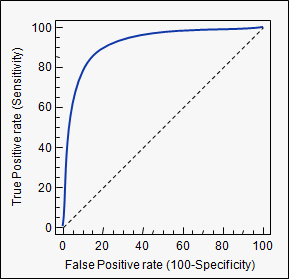
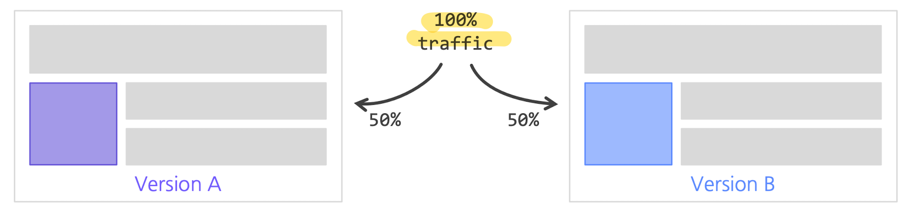

# Metric

## 💡 Metric에 어떤 것들이 있는지 설명해주세요.

**분류 문제**

1. Precision(정밀도)
   - 모델이 True라고 분류한 것 중에서 실제 True인 것의 비율을 의미합니다.

$$
(Precision) = \frac{TP}{TP + FP}
$$

**Positive 정답률**, **PPV(Positive Predictive Value)** 라고도 불립니다.

2. Recall (재현율)
   - 재현율이란 실제 True인 것 중에서 모델이 True라고 예측 한 것의 비율을 의미합니다.
   - 통계학에서는 sensitivity으로, 그리고 다른 분야에서는 hit rate라는 용어로도 사용합니다.

$$
(Recall) = \frac{TP}{TP + FN}
$$

> 즉, Precision이나 Recall은 모두 실제 True인 정답을 모델이 True라고 예측한 경우에 관심이 있으나, 바라보고자 하는 관점만 다릅니다.
>
> `Precision은 모델의 입장`에서, 그리고 `Recall은 실제 정답(data)의 입장`에서 정답을 정답이라고 맞춘 경우를 바라보고 있습니다.

3. F1-score
   - Precision과 Recall의 `조화평균`이 F1 스코어입니다.
   - 조화평균을 이용하면 산술평균을 이용하는 것보다, 큰 비중이 끼치는 bias가 줄어든다고 볼 수 있습니다.

$$
(F_1) = 2 \times \frac{Precision \times Recall}{Precision + Recall}
$$

4. Accuracy(정확도)

   - 가장 `직관적으로 모델의 성능`을 나타낼 수 있는 평가 지표지만 domain의 `편중을 고려`해야합니다.
   - ex) 우리가 예측하고자 하는 한 달 동안 특정 기후에 부합하여 비오는 날이 흔치 않다고 가정
     - 해당 data의 domain이 불균형하게 되므로 맑은 것을 예측하는 성능은 높지만, 비가 오는 것을 예측하는 성능은 매우 낮을 수 밖에 없습니다. 따라서 이를 보완할 지표들이 필요합니다.

$$
(Accuracy) = \frac{TP + FN}{TP+FP+FN+TN}
$$

5. Fall-Out(FPR : False Positive Rate)

   - 실제 False인 data 중에서 모델이 True라고 예측한 비율

$$
\text{Fall-out}(FPR)=\frac{FP}{TN+FP}
$$

    

6. ROC(Receiver Operating Characteristic) curve
   - 여러 임계값들을 기준으로 Recall-Fallout의 변화를 시각화한 것입니다.
   - Fallout은 실제 False인 Data 중에서 모델이 True로 분류한, 그리고 Recall은 실제 True인 Data 중에서 모델이 True로 분류한 비율을 나타낸 지표로써, 이 두 지표를 각각 x,y의 축으로 놓고 그려지는 그래프를 해석합니다.
   - curve가 왼쪽 위 모서리에 가까울수록 모델의 성능이 좋다고 평가합니다.
   - 즉, Recall이 크고 Fall-out이 작은 모형이 좋은 모형인 것입니다. 또한 y=x 그래프보다 상단에 위치해야 어느정도 성능이 있다고 말할 수 있습니다.

7. AUC(Area Under Curve)
   - ROC curve는 그래프이기 때문에 명확한 수치로써 비교하기가 어렵습니다. 따라서 그래프 아래의 면적값을 이용합니다. 이것이 바로 AUC(Area Under Curve)입니다.
   - 최대값은 1이며 좋은 모델(즉, Fall-out에 비해 Recall 값이 클수록) 1에 가까운 값이 나옵니다.

**회귀 문제**

1. MAE

- 예측값과 정답값 사이의 차이의 절대값의 평균을 의미합니다.

$$
MAE = \frac{1}{N} \sum^N_{i=1} |y_i - \acute{y_i}|
$$

2. MSE

- **예측값과 정답값 사이의 차이의 제곱의 평균**을 말하며, MAE와 달리 제곱을 했기 때문에 이상치에 민감합니다.

$$
MSE = \frac{1}{N} \sum^N_{i=1} (y_i - \acute{y_i})^2
$$

3. RMSE

- **MSE에 루트를 씌운 값**을 의미합니다.

$$
RMSE = \sqrt{MSE} = \sqrt{\frac{1}{N} \sum^N_{i=1} (y_i - \acute{y_i})^2}
$$

4. RMSLE

- RMSE와 비슷하나 **예측값과 정답값에 각각 로그를 씌워 계산**합니다.

$$
RMSLE = \sqrt{\frac{1}{N} \sum^N_{i=1} (\log(y_i+1) - \log(\acute{y_i}+1))^2}
$$

6. R Squared

- **분산을 기반으로 예측 성능을 평가하는 지표**를 의미합니다.
- 정답값의 분산 대비 예측값의 분산 비율을 지표로 하며, 1에 가까울수록 정확도가 높습니다.

**추천 시스템의 평가 지표**
추천 시스템의 성능을 평가하는 데에 사용되는 대표적인 방법들을 살펴보았습니다.

1. 개요
   새로 적용한 추천 시스템 혹은 추천 모델의 성능 평가는 어떻게 해야하는가?

   1. `비즈니스 / 서비스 관점`

      - 추천 시스템 적용으로 인해 `매출` 및 `PV 증가` (PV : Page View(방문횟수))
      - 추천 아이템으로 인해 유저의 `CTR` 상승 (CTR : 노출대비 클릭 횟수)

   2. 품질 관점
      - `연관성`(Relevance) : 추천된 아이템이 유저에게 `관련`이 있는가?
      - `다양성`(Diversity) : 추천된 Top-K 아이템에 얼마나 `다양한` 아이템에 추천되는가?
      - `새로움`(Novelty) : 얼마나 `새로운 아이템이 추천`되고 있는가?
      - `참신함`(Serendipity) : 유저가 기대하지 못한 `뜻밖의 아이템`이 추천되는가?
        - 메인 관점은 아님

2. Offline Test

- `새로운 추천 모델을 검증`하기 위해 `가장 우선적으로 수행`되는 단계입니다

  - 유저로부터 수집한 데이터를 `Train/Val/Test`로 나누어 모델의 성능을 `객관적인 지표`로 평가합니다.
  - `보통 offline test에서 좋은 성능을 보여야 online 서빙에 투입되지만, 실제 서비스 상황에서는 다양한 양상을 보입니다 (Serving Bias 존재)`
  - `Serving Bias` : 모델 학습 과정에서는 지표를 통해서 학습이 되지만 서비스가 투입되었을 때는 아웃풋으로 만들어진 결과에 따른 로그를 확인하고 재학습 시킵니다.

- 성능 지표

  - 랭킹 문제 : `Precision@K`, `Recall@K`, `MAP@K`, `nDCG@K`, `Hit Rate`
  - 예측 문제 : `RMSE`, `MAE`

- Precision/Recall @K
  - Precision@K : 우리가 추천한 `K개 아이템 가운데` 실제 유저가 관심있는 아이템의 비율
  - Recall@K : 유저가 관심있는 `전체 아이템 가운데` 우리가 추천한 아이템의 비율
    ex) 우리가 추천한 아이템 개수 : 5(K)
    추천한 아이템 중 유저가 관심있는 아이템 개수 : 2 → `Precision@5 = 2/5`
    유저가 관심있는 아이템의 전체 개수 : 3 → `Recall@5 = 2/3`
- Mean Average Precision(MAP) @K

  - `AP@K`

    - $AP@K = \frac{1}{m} \Sigma_{i=1}^{K}Precision@i$

    - `Precision@1` 부터 `Precision@K` 까지의 평균값
    - Precision@K와 달리, `관련 아이템을 더 높은 순위에 추천`할수록 `점수가 상승함`

  - `MAP@K`
    - $MAP@K = \frac{1}{|U|}\Sigma_{u=1}^{|U|}(AP@K)_u$
    - 모든 유저에 대한 Average Precision 값의 평균

- Normalized Discounted Cumulative Gain(NDCG)

  - 추천 시스템에 가장 많이 사용 되는 지표 중 하나, 원래는 `검색(Information Retrieval)에서 등장한 지표`
  - Precision@K, MAP@K와 마찬가지로 `Top K 리스트를 만들고` `유저가 선호하는 아이템을 비교`하여 값을 구현
  - MAP@K와 마찬가지로 `추천의 순서에 가중치를 더 많이 두어` 성능을 평가하며 `1에 가까울수록 좋음`
  - MAP와 달리, 연관성을 이진(binary) 값이 아닌 `수치로도 사용 할 수 있기 때문에` 유저에게 얼마나 더 관련 있는 아이템을 상위로 노출시키는지 알 수 있음.

  - nDCG Formula

    1. `Cumulative Gain` : 상위 K개 아이템에대하여 관련도를 합한 것 순서에 따라 Discount하지 않고 동일하게 더한 값

       - $CG_K = \Sigma_{i=1}^Krel_i$

    2. `Ideal DCG` : 이상적인 추천이 일어났을 때의 DCG값 가능한 DCG 값 중에 제일 크다

       - $IDCG = \Sigma_{i=1}^{K}\frac{rel^{opt}_i}{log_2(i+1)}$

    3. `Discounted Cumulative Gain` : 순서에 따라 Cumulative Gain을 Discount함

       - $DCG_K = \Sigma_{i=1}^K\frac{rel_i}{log_2(i+1)}$

    4. `Normalized DCG` : 추천 결과에 따라 구해진 DCG를 IDCG로 나눈 값
       - $NDCG = \frac{DCG}{IDCG}$

    - **추천 순서까지 고려했을때**의 이상적인 추천에 대한 추천 결과의 비율

- NDCG 예제
  NDCG@5 구하기

  - Ideal Order : [C(3), A(3), B(2), E(2), D(1)]
  - `→ Relevance의 내림차순으로 정렬하여 추천 하는 것이 이상적`입니다
  - Recommend Order : [E, A, C, D, B]

  - $DCG@5 = \frac{2}{log_2(1+1)} +\frac{3}{log_2(2+1)}+\frac{3}{log_2(3+1)}+\frac{1}{log_2(4+1)}+\frac{2}{log_2(5+1)}=6.64$

  - $IDCG@5=\frac{3}{log_2(1+1)} + \frac{3}{log_2(2+1)} + \frac{2}{log_2(3+1)} + \frac{2}{log_2(4+1)} + \frac{1}{log_2(5+1)} = 7.14$

  - $NDCG@5 = \frac{DCG}{IDCG} = \frac{6.64}{7.14} = 0.93$

3. Online Test
   Online A/B Test란?

- Offline Test에서 검증된 가설이나 모델을 이용해 실제 추천 결과를 서빙하는 단계
  

  - 추천 시스템 변경 전후의 성능을 비교하는 것이 아니라, `동시에 대조군(A)과 실험군(B)의 성능을 평가` (대조군과 실험군의 환경은 최대한 동일해야함)
  - 실제 서비스를 통해 얻어지는 결과를 통해 최종 의사결정이 이루어짐

- 대부분 현업에서 의사결정에 사용하는 최종 지표는 모델 성능이 아닌 매출, CTR 등의 비즈니스/서비스 지표

## 📑 꼬리질문

### 사용한 Metric과 Metric 선정 이유를 설명해주세요

- 부스트캠프 AI Tech의 최종 프로젝트에 적용한 커피 추천 시스템에는 `Contents-Based Filtering` 모델과, `Collaborative Filtering` 모델을 활용했습니다.

  - Contents-Based Filtering에 사용한 Metric은 Euclidian Distance와 Entropy-Diversity입니다.
    - `Euclidian Distance`는 추천된 아이템과 사용자가 실제 선호하는 아이템 간의 거리를 줄이기 위해서 사용했습니다.
      - `Manhattan Distance`를 사용하지 않은 이유는 큰 차이에 더 민감하게 Loss를 적용하기 위함입니다.
    - `Entropy-Diversity`는 추천의 다양성까지 고려하기 위해 사용했습니다.
  - Collaborative Filtering에 사용한 Metric은 Precision@k 입니다.
    - `Precision@k`는 모델 추천 결과에서 사용자가 선호하는 제품을 최대한 추천해주기 위해 사용하였습니다.
      - `Recall@k`를 사용하지 않은 이유는 interaction 개수가 매우 적은 유저들이 많이 존재했기 때문에 적절하게 사용하지 못한다고 판단했습니다.
      - `CG(Cumulative Gain)` 기반의 메트릭을 사용하지 않은 이유는 적절한 relevance score를 부여하기 어렵기 때문이며, 추천의 순서가 중요하지 않았기 때문입니다.

- 전력연구원에서 수행한 전력 데이터 이상치 탐지 및 결측치 보정에 대한 연구에 활용한 Metric은 RMSE입니다.

  - `RMSE`는 오차의 제곱을 평균한 값의 제곱근이기 때문에 MAE, MedAE 등을 사용할 때보다 더 큰 오차에 민감하게 반응하는 특성이 있어 사용하였습니다.

- **Movie Recommendation**
  사용자의 영화 시청 이력 데이터를 바탕으로 사용자가 다음에 시청할 영화 및 좋아할 영화를 예측

  - 랭킹 문제에서 Offline Test의 성능지표로 사용되는 Recall@K를 Metric으로 사용했습니다.
  - Recall@K: 유저가 관심있는 전체 아이템 가운데 우리가 추천한 아이템의 비율

- **Book Rating Prediction**
  사용자의 책 평점 데이터를 바탕으로 사용자가 어떤 책을 더 선호할지 예측하는 태스크입니다.

  $$
  RMSE = \sqrt{\frac{1}{N}\Sigma}^N_{i=1}(y_i-\hat{y_i})^2
  $$

  - 평점 예측에서 자주 사용되는 지표 중 하나인 **RMSE (Root Mean Square Error)**를 사용
  - 사용자가 그동안 읽은 책에 부여한 평점 데이터를 사용해서 새로운 책을 추천했을 때 어느 정도의 평점을 부여할지 예측하는 **회귀**문제로 봤기 때문에 RMSE를 사용

 

## 🐍 꼬꼬무

### 왜 F1 Score를 사용하는가?

불균형 데이터 분류 문제에서 각 클래스의 샘플 수가 `불균형한 상황`에서는 Accuracy가 좋은 Metric이 아니기 때문에
Recall과 Precision 지표의 조화평균치를 통하여 조금 더 정확하게 모델의 예측 성능을 평가할 수 있습니다.

 

## 📚 Reference

[티스토리 - 갈아먹는 추천 알고리즘[6] 추천 엔진 성능 지표](https://yeomko.tistory.com/32)

[티스토리 - 회귀/분류시 알맞은 metric과 그에 대한 설명](https://mole-starseeker.tistory.com/30)

[티스토리 - 분류 성능 평가 지표](https://sumniya.tistory.com/26)

[벨로그 - 추천시스템의 평가 지표](https://velog.io/@zsmalla/%EC%B6%94%EC%B2%9C%EC%8B%9C%EC%8A%A4%ED%85%9C%EC%9D%98-%ED%8F%89%EA%B0%80-%EC%A7%80%ED%91%9C)
